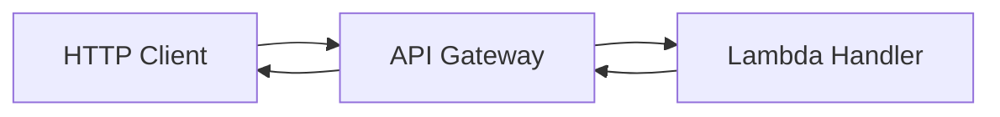

# API Gateway Lambda Serverless API

API Gateway + Lambda is a serverless request/response pattern. API Gateway handles HTTP concerns and routes requests to Lambda, which runs business logic.

## Problem it solves

Use this pattern when you want to expose HTTP APIs without managing servers. It centralizes auth, throttling, and routing while keeping app logic in short-lived functions.

It is not ideal for long-running streaming responses or highly stateful connection handling.

## When to use

- You need a small-to-medium REST API quickly.
- Traffic is bursty and benefits from automatic scaling.
- You want built-in request auth, throttling, and logging controls.

## Basic flow

1. A client sends an HTTP request to API Gateway.
2. API Gateway validates and routes the request.
3. Lambda processes the request and returns JSON.
4. API Gateway maps Lambda output to an HTTP response.

## What happens in AWS

- API Gateway provides routing, usage controls, and API front door capabilities.
- Lambda scales based on request load.
- CloudWatch stores API access logs and Lambda logs.
- Failures are returned as HTTP errors with controlled response mapping.

## Message shape

A minimal proxy-style event shape looks like:

```json
{
  "httpMethod": "POST",
  "path": "/orders",
  "body": "{\"orderId\":\"order-123\"}"
}
```

Lambda returns a response envelope with `statusCode` and `body`.

## Mermaid diagram



## Example code

The `example/` folder uses Python to show a compact Lambda router and API event handling.

The `cdk/` folder uses AWS CDK in TypeScript to provision API Gateway and Lambda integration.

### Example snippets

```python
def parse_json_body(body: str | None) -> dict:
	if not body:
		return {}
	return json.loads(body)
```

```python
def handler(event, context):
	method = event.get("httpMethod")
	path = event.get("path")
	if method == "GET" and path == "/health":
		return response(200, {"status": "ok"})
```

### CDK snippet

```ts
const api = new apigw.RestApi(this, 'OrdersApi');
const orders = api.root.addResource('orders');
orders.addMethod('POST', new apigw.LambdaIntegration(handler));
```

## Why it fits AWS well

- API Gateway is managed and production-ready for HTTP APIs.
- Lambda gives elastic backend compute with pay-per-request pricing.
- Native integration keeps deployment and operations simple.

## Failure handling

- Validate request body and fields before processing.
- Return explicit status codes for client vs server failures.
- Use structured logs with request IDs for debugging.
- Protect downstream systems with API throttling and Lambda reserved concurrency.

## Security and observability

- Use IAM, Cognito, or authorizers for API authentication.
- Restrict Lambda permissions to least privilege.
- Enable API access logs and CloudWatch metrics.
- Monitor 4xx/5xx rates, latency, and Lambda error counts.

## Tradeoffs

- Cold starts can affect p99 latency for low-traffic routes.
- Large monolithic handlers can become hard to maintain.
- API Gateway mapping/auth complexity grows with advanced requirements.

## Try it locally

1. Run the Python tests in `example/`.
2. Run `npm test -- --runInBand` in `cdk/`.
3. Use `cdk synth` to inspect the generated infrastructure before deployment.
