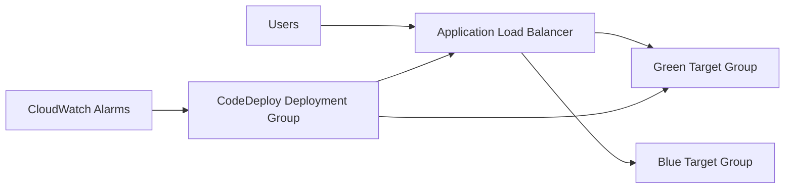

# Blue Green Deployment

Blue/Green Deployment runs two production-like environments: current (blue) and new (green). Traffic stays on blue until green is validated, then cutover switches traffic to green with fast rollback available by switching back.

## Problem it solves

In-place upgrades can cause downtime and make rollback slow. Blue/green reduces release risk by validating a full new environment before user traffic is shifted.

Use this pattern for customer-facing services where deployment safety and rollback speed are critical.

## When to use

- You need near-zero-downtime releases.
- Rollback must be immediate and low-risk.
- You can afford parallel environment capacity during rollout.
- You want pre-cutover validation with health checks.

## Basic flow

1. Deploy new version to green environment.
2. Run health checks and smoke tests against green.
3. Shift production traffic from blue to green.
4. Monitor key metrics after cutover.
5. Roll back to blue instantly if needed.

## What happens in AWS

- CodeDeploy manages blue/green lifecycle and traffic switch.
- ALB target groups represent blue and green environments.
- Auto Scaling groups or ECS services host each environment.
- CloudWatch alarms gate rollout and trigger automatic rollback.

## Message shape

Deployment request:

```json
{
	"application": "billing-api",
	"version": "v2.3.0",
	"strategy": "blue-green"
}
```

Cutover event:

```json
{
	"status": "cutover-complete",
	"from": "blue",
	"to": "green",
	"timestamp": "2026-07-25T12:30:00Z"
}
```

Rollback event:

```json
{
	"status": "rollback",
	"active": "blue",
	"reason": "alarm-breach"
}
```

## Mermaid diagram



## Example code

The `example/` folder includes a Python traffic-router simulation with deployment validation, cutover, and rollback logic.

The `cdk/` folder contains a reference stack with ALB target groups, Lambda alias traffic hook points, and CodeDeploy deployment group configuration.

### Example snippets

```python
if not green_healthy:
		return {"status": "rollback", "active": "blue", "reason": "health-check-failed"}
```

```python
active = "green"
return {"status": "cutover-complete", "from": "blue", "to": active}
```

### CDK snippet

```ts
new codedeploy.LambdaDeploymentGroup(this, 'DeploymentGroup', {
	alias,
	deploymentConfig: codedeploy.LambdaDeploymentConfig.LINEAR_10PERCENT_EVERY_1MINUTE,
	autoRollback: { failedDeployment: true, stoppedDeployment: true, deploymentInAlarm: true },
});
```

## Why it fits AWS well

- CodeDeploy provides native blue/green orchestration and rollback.
- ALB target groups make traffic switching explicit and auditable.
- CloudWatch alarms can automatically stop or roll back deployments.
- Works across Lambda, ECS, and EC2 deployment models.

## Failure handling

- Require green health checks before any cutover.
- Automate rollback on latency/error alarm breaches.
- Keep blue running until post-cutover verification completes.
- Use immutable artifacts to avoid drift between environments.

## Security and observability

- Use signed artifacts and least-privilege deployment roles.
- Track deployment events, cutover time, and rollback triggers.
- Correlate release versions with logs and metrics.
- Protect deployment APIs with strict IAM boundaries.

## Tradeoffs

- Requires duplicate capacity during rollout.
- Environment parity must be carefully maintained.
- Infrastructure costs increase during overlapping windows.
- Stateful systems may need extra data migration planning.

## Try it locally

1. Run `pytest -q` in `example/`.
2. Run `npm install` and `npm test -- --runInBand` in `cdk/`.
3. Run `npm run cdk -- synth` to inspect deployment resources.
