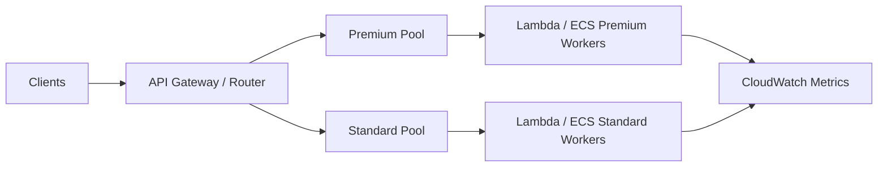

# Bulkhead

Bulkhead isolates resources so failure or overload in one workload slice does not consume capacity needed by others. The pattern is named after ship compartments: damage in one section should not sink the entire vessel.

## Problem it solves

When multiple request types share the same thread pool, queue, or compute tier, one noisy or failing path can starve all others. Bulkheads create separate capacity pools for critical and non-critical traffic.

Use this pattern when different workloads have different reliability priorities and should not compete for the same execution budget.

## When to use

- You serve mixed criticality workloads from one system.
- A bursty background job can impact user-facing requests.
- You need explicit per-segment concurrency or throughput limits.
- You want graceful degradation where only one segment is affected.

## Basic flow

1. Classify requests into segments (for example, premium and standard).
2. Route each segment to a dedicated capacity pool.
3. Apply independent limits and scaling per segment.
4. If one pool saturates, other pools continue operating.

## What happens in AWS

- API Gateway routes requests by path, header, or usage plan.
- Separate Lambda functions or reserved concurrency partitions isolate compute.
- Distinct SQS queues and consumers isolate async workloads.
- CloudWatch alarms trigger independently per segment.

## Message shape

Request:

```json
{
	"requestId": "req-801",
	"tenantTier": "premium",
	"operation": "createInvoice"
}
```

Routed execution response:

```json
{
	"status": "accepted",
	"segment": "premium",
	"pool": "premium-workers",
	"concurrencyLimit": 50
}
```

Rejected due to pool saturation:

```json
{
	"status": "rejected",
	"segment": "standard",
	"reason": "pool-saturated"
}
```

## Mermaid diagram



## Example code

The example demonstrates a lightweight in-memory bulkhead limiter in Python with independent pools and tests proving one saturated pool does not block another.

The CDK stack provisions two SQS queues and two Lambda consumers with independent reserved concurrency settings.

### Example snippets

```python
if self.in_flight[pool_name] >= self.limits[pool_name]:
		return False
self.in_flight[pool_name] += 1
```

```python
segment = classify(request)
pool = pool_for_segment(segment)
if not bulkhead.try_acquire(pool):
		return {"status": "rejected", "segment": segment, "reason": "pool-saturated"}
```

### CDK snippet

```ts
const premiumWorker = new lambda.Function(this, 'PremiumWorker', {
	runtime: lambda.Runtime.PYTHON_3_12,
	handler: 'index.handler',
	reservedConcurrentExecutions: 50,
	code: lambda.Code.fromInline("def handler(event, context): return {'statusCode': 200}"),
});
```

## Why it fits AWS well

- Lambda reserved concurrency gives hard per-function isolation.
- Separate queues and consumers isolate backlog and throughput.
- API Gateway routing and throttling policies map cleanly to segments.
- Per-segment CloudWatch alarms improve operational clarity.

## Failure handling

- Reject or defer only the saturated segment.
- Keep fallback behavior explicit for each segment.
- Monitor queue age and concurrency usage per pool.
- Avoid cross-pool dependencies that break isolation guarantees.

## Security and observability

- Apply least-privilege IAM per segment worker.
- Track accepted, rejected, and saturation counts by segment.
- Include segment labels in structured logs and traces.
- Alert separately for critical and non-critical pools.

## Tradeoffs

- More queues/functions increase infrastructure complexity.
- Idle capacity in one segment cannot always help another.
- Requires careful capacity planning and segmentation strategy.
- Misclassification can send traffic to wrong pool.

## Try it locally

1. Run `pytest -q` in `example/`.
2. Run `npm install` and `npm test -- --runInBand` in `cdk/`.
3. Run `npm run cdk -- synth` to inspect generated infrastructure.
