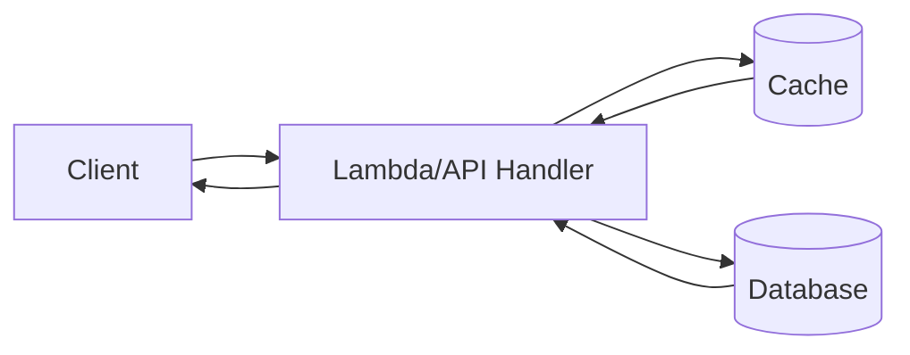

# Cache Aside

Cache-Aside improves read performance by checking a cache first and only querying the primary database on cache misses. The application is responsible for populating and updating the cache.

## Problem it solves

Use this pattern when repeated reads for the same keys cause avoidable load and latency on your primary datastore. It reduces round-trips to the source of truth for hot data.

It is not ideal for workloads with very low read repetition or where strict read-after-write consistency is required for every request.

## When to use

- Read-heavy APIs with hot keys.
- Expensive or slower database reads.
- Data that tolerates short-lived staleness.

## Basic flow

1. Application receives a read request.
2. App checks cache by key.
3. On cache hit, app returns cached value.
4. On miss, app reads from database, stores value in cache with TTL, then returns result.

## What happens in AWS

- Lambda or API handlers execute cache-aside logic.
- ElastiCache (Redis) is commonly used as the cache tier.
- DynamoDB or RDS remains the source of truth.
- CloudWatch metrics help track cache hit/miss behavior and latency.

## Message shape

A simple read request event might look like:

```json
{
  "productId": "p-1001"
}
```

The handler returns a value and indicates whether it came from cache or database.

## Mermaid diagram



## Example code

The `example/` folder uses Python for concise cache hit/miss logic.

The `cdk/` folder uses AWS CDK in TypeScript to provision a Lambda function and DynamoDB table for the data-source side of the pattern.

### Example snippets

```python
cached = cache_client.get(cache_key)
if cached is not None:
	return {"product": cached, "source": "cache"}
```

```python
item = ddb_client.get_item(TableName=table_name, Key={"productId": {"S": product_id}})
if "Item" in item:
	product = _decode_item(item["Item"])
	cache_client.set(cache_key, product, ttl_seconds)
```

### CDK snippet

```ts
const table = new dynamodb.Table(this, 'ProductsTable', {
	partitionKey: { name: 'productId', type: dynamodb.AttributeType.STRING },
	billingMode: dynamodb.BillingMode.PAY_PER_REQUEST,
});

table.grantReadData(reader);
```

## Why it fits AWS well

- ElastiCache provides managed, low-latency caching.
- DynamoDB handles durable storage and scale.
- Lambda allows efficient read APIs with burst handling.

## Failure handling

- On cache failures, fall back to database reads.
- Use TTLs to limit stale data duration.
- Invalidate or update cache keys after writes.
- Track and alert on elevated miss rates or DB fallback spikes.

## Security and observability

- Use least-privilege IAM for database reads.
- Keep cache and data store in private networking paths where needed.
- Monitor cache hit ratio, latency, Lambda duration, and DB read capacity.
- Avoid caching sensitive data unless encryption and access controls are clear.

## Tradeoffs

- Stale reads are possible within TTL windows.
- Cache invalidation adds complexity.
- Extra infrastructure and operational tuning may be needed.

## Try it locally

1. Run the Python tests in `example/`.
2. Run `npm test -- --runInBand` in `cdk/`.
3. Use `cdk synth` to inspect the generated infrastructure before deployment.
