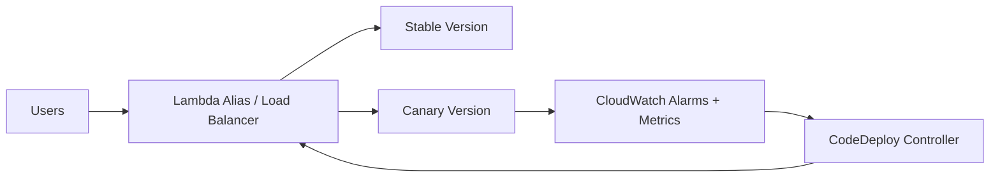

# Canary Deployment

Canary Deployment releases a new version to a small slice of traffic first, then gradually increases the percentage if metrics remain healthy. It reduces blast radius compared to full cutover and enables data-driven release decisions.

## Problem it solves

Immediate 100% rollout can impact all users if a hidden defect exists. Canary limits exposure by testing the new version under real production traffic before full promotion.

Use this pattern when release confidence is high but not absolute, and you need controlled progressive delivery.

## When to use

- You want production validation before full rollout.
- Rollback needs to be fast with minimal user impact.
- You have monitoring for latency, errors, and business KPIs.
- You can tolerate temporary split traffic across versions.

## Basic flow

1. Deploy the new version beside the stable version.
2. Route a small percent of traffic to the canary.
3. Observe alarms, SLOs, and business metrics.
4. Increase traffic in steps if healthy.
5. Promote to 100% or roll back on threshold breach.

## What happens in AWS

- CodeDeploy manages weighted traffic shift for Lambda or ECS.
- Lambda alias routing can send percentages to old and new versions.
- CloudWatch alarms stop deployment and trigger rollback.
- Deployment events are logged for audit and release analysis.

## Message shape

Deployment request:

```json
{
	"application": "checkout-api",
	"candidateVersion": "v1.14.0",
	"strategy": "canary"
}
```

Canary progression event:

```json
{
	"stage": "10-percent",
	"status": "healthy",
	"next": "50-percent"
}
```

Rollback event:

```json
{
	"status": "rollback",
	"reason": "error-rate-alarm",
	"activeVersion": "v1.13.2"
}
```

## Mermaid diagram



## Example code

The example folder provides a Python simulation of weighted routing, health checks, and progressive promotion or rollback decisions.

The cdk folder provides a Lambda alias and CodeDeploy deployment group configured with canary traffic shifting and rollback safeguards.

### Example snippets

```python
if error_rate > max_error_rate:
		return {"status": "rollback", "reason": "error-rate-alarm"}
```

```python
return {
		"status": "promote",
		"nextWeight": min(100, current_weight + step),
}
```

### CDK snippet

```ts
new codedeploy.LambdaDeploymentGroup(this, 'CanaryDeploymentGroup', {
	alias,
	deploymentConfig: codedeploy.LambdaDeploymentConfig.CANARY_10PERCENT_5MINUTES,
	autoRollback: { failedDeployment: true, stoppedDeployment: true },
});
```

## Why it fits AWS well

- CodeDeploy has built-in canary deployment configurations.
- Lambda alias weights make gradual traffic shifts straightforward.
- CloudWatch alarms integrate directly with deployment rollback.
- Works for both API and async workloads with proper KPIs.

## Failure handling

- Define strict rollback thresholds before rollout.
- Keep canary windows long enough to capture realistic behavior.
- Separate transient noise from true degradation signals.
- Preserve previous version artifacts for immediate rollback.

## Security and observability

- Restrict deployment permissions to release automation roles.
- Log each traffic shift stage and decision reason.
- Correlate version labels with traces and logs.
- Alert on canary-specific error spikes and latency shifts.

## Tradeoffs

- Longer release duration than instant cutover.
- Requires reliable monitoring and alert quality.
- Temporary version skew can complicate debugging.
- Stateful migrations need backward compatibility during overlap.

## Try it locally

1. Run pytest -q in example.
2. Run npm install and npm test -- --runInBand in cdk.
3. Run npm run cdk -- synth to inspect the deployment resources.
