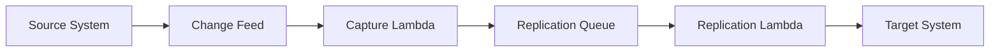

# Change Data Capture Data Replication

Change Data Capture (CDC) / Data Replication captures changes from a source system and propagates them to downstream systems without requiring consumers to query the source directly. Instead of doing periodic full copies, the system reacts to inserts, updates, and deletes as change events.

## Problem it solves

Use this pattern when another service, index, region, or analytical store needs to stay synchronized with source-system changes. Full-table polling is expensive and slow, while CDC provides incremental replication with lower lag and less load on the primary system.

It is not ideal when downstream copies do not need to stay current.

## When to use

- Downstream systems need near-real-time copies of source changes.
- Polling the full source dataset is too slow or expensive.
- You need replication into search, analytics, or another region.
- A source system already exposes logs or stream-based changes.

## Basic flow

1. A source record changes.
2. The source emits or exposes a change event.
3. A capture process reads the change event.
4. A replication process applies the change to a downstream target.

## What happens in AWS

- DynamoDB Streams, database logs, or DMS can provide the change feed.
- Lambda can capture and transform changes.
- SQS, Kinesis, or EventBridge can buffer replication handoff.
- A downstream consumer applies the change to the target system.

## Message shape

Captured change:

```json
{
	"entityId": "cust-1",
	"operation": "UPSERT",
	"payload": {
		"email": "a@example.com"
	}
}
```

Replicated target view:

```json
{
	"entityId": "cust-1",
	"replicatedOperation": "UPSERT",
	"payload": {
		"email": "a@example.com"
	}
}
```

## Mermaid diagram



## Example code

The `example/` folder uses Python to show a source change log, a capture step, and a replication step into a target store.

The `cdk/` folder uses AWS CDK in TypeScript to provision a source table with streams semantics, a relay queue, and capture/replication functions.

### Example snippets

```python
def capture_change(event: dict) -> dict:
		SOURCE_LOG.append(event)
		return event
```

```python
def replicate_change(event: dict) -> dict:
		TARGET_STORE[event["entityId"]] = {
				"entityId": event["entityId"],
				"replicatedOperation": event["operation"],
				"payload": event["payload"],
		}
		return TARGET_STORE[event["entityId"]]
```

### CDK snippet

```ts
const sourceTable = new dynamodb.Table(this, 'SourceTable', {
	partitionKey: { name: 'entityId', type: dynamodb.AttributeType.STRING },
	billingMode: dynamodb.BillingMode.PAY_PER_REQUEST,
	stream: dynamodb.StreamViewType.NEW_AND_OLD_IMAGES,
});

const targetQueue = new sqs.Queue(this, 'ReplicationQueue');
```

## Why it fits AWS well

- DynamoDB Streams and DMS provide native CDC-friendly building blocks.
- Lambda makes capture and transformation steps lightweight.
- Queues and streams decouple capture from downstream apply speed.

## Failure handling

- Make replication idempotent so repeated changes do not corrupt the target.
- Buffer changes durably so downstream outages do not lose updates.
- Track replication lag and replay capability from the captured log.
- Handle deletes explicitly, not just upserts.

## Security and observability

- Limit stream or log read access to the capture function.
- Grant replication consumers only the target-write permissions they need.
- Monitor change backlog, apply failures, and replication lag.
- Log the entity id and operation type at each replication stage.

## Tradeoffs

- Replicated targets are eventually consistent with the source.
- Ordering and replay semantics require care when multiple changes happen quickly.
- Replication pipelines add operational complexity beyond direct reads.

## Try it locally

1. Run the Python tests in `example/`.
2. Run `npm install` and `npm test -- --runInBand` in `cdk/`.
3. Use `npm run cdk -- synth` to inspect the generated infrastructure.
