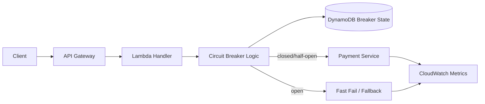

# Circuit Breaker

Circuit Breaker prevents repeated calls to an unhealthy dependency by detecting failures and temporarily short-circuiting requests. It helps protect upstream services from cascading latency and allows downstream systems time to recover.

## Problem it solves

When a dependency becomes slow or unavailable, retry storms and hanging requests can degrade every caller in the path. A circuit breaker stops the flow after a threshold of failures and fails fast instead of waiting on repeated timeouts.

Use this pattern when your service depends on APIs, databases, or queues that may intermittently fail and you want controlled degradation.

## When to use

- You call a remote dependency with variable latency or reliability.
- Repeated retries are causing queue buildup, thread exhaustion, or cost spikes.
- You need predictable fallback behavior under dependency failure.
- You want automatic recovery checks before fully reopening traffic.

## Basic flow

1. In the closed state, requests pass through normally.
2. Failures are counted in a rolling window.
3. When the threshold is reached, the breaker moves to open and fails fast.
4. After a cool-down period, the breaker enters half-open and allows a limited probe call.
5. If the probe succeeds, the breaker closes; if it fails, the breaker reopens.

## What happens in AWS

- API Gateway or ALB receives incoming requests.
- A Lambda function reads and updates circuit state (often in DynamoDB or ElastiCache).
- Calls to the dependency are gated by breaker state.
- CloudWatch alarms and metrics track open/close transitions and fallback rate.

## Message shape

The example request and response are:

```json
{
	"operation": "chargeCustomer",
	"requestId": "req-101",
	"amount": 42.5
}
```

Successful response:

```json
{
	"status": "ok",
	"breakerState": "CLOSED",
	"result": {
		"transactionId": "txn-9001"
	}
}
```

Fast-fail response while open:

```json
{
	"status": "rejected",
	"breakerState": "OPEN",
	"reason": "circuit-open"
}
```

## Mermaid diagram



## Example code

The `example/` folder provides a pure Python circuit breaker with closed/open/half-open behavior, failure counting, and probe-based recovery.

The `cdk/` folder provisions a reference architecture in AWS CDK (TypeScript): API Gateway, Lambda, and DynamoDB for state persistence.

### Example snippets

```python
if self.state == "OPEN":
		if now - self.opened_at >= self.recovery_timeout_seconds:
				self.state = "HALF_OPEN"
		else:
				raise CircuitOpenError("circuit-open")
```

```python
try:
		result = dependency(payload)
		breaker.on_success(now)
		return {"status": "ok", "breakerState": breaker.state, "result": result}
except Exception:
		breaker.on_failure(now)
		return {"status": "failed", "breakerState": breaker.state}
```

### CDK snippet

```ts
const stateTable = new dynamodb.Table(this, 'CircuitStateTable', {
	partitionKey: { name: 'circuitId', type: dynamodb.AttributeType.STRING },
	billingMode: dynamodb.BillingMode.PAY_PER_REQUEST,
	removalPolicy: cdk.RemovalPolicy.DESTROY,
});
```

## Why it fits AWS well

- Lambda can enforce breaker policy close to compute logic.
- DynamoDB provides low-latency state reads/writes at scale.
- CloudWatch offers native alarms, logs, and dashboards for breaker health.
- API Gateway usage plans and throttling combine well with fast-fail behavior.

## Failure handling

- Keep recovery timeout short enough for fast recovery but long enough to avoid flapping.
- Separate business failures from infrastructure failures so breaker thresholds are meaningful.
- Add jitter to probe attempts in high-concurrency workloads.
- Provide a deterministic fallback response for clients when open.

## Security and observability

- Store only circuit metadata in DynamoDB, not sensitive payloads.
- Emit structured logs for transitions: closed->open, open->half-open, half-open->closed.
- Track metrics: open count, probe success rate, fallback rate, dependency latency.
- Use IAM least privilege for Lambda access to state table.

## Tradeoffs

- Requires careful threshold tuning for each dependency.
- Adds state management and testing complexity.
- Can hide downstream recovery if recovery timeout is too aggressive.
- Fallback responses may reduce feature completeness during incidents.

## Try it locally

1. Run `pytest -q` in `example/` to validate breaker behavior.
2. Run `npm install` and `npm test -- --runInBand` in `cdk/`.
3. Run `npm run cdk -- synth` to inspect generated infrastructure.
