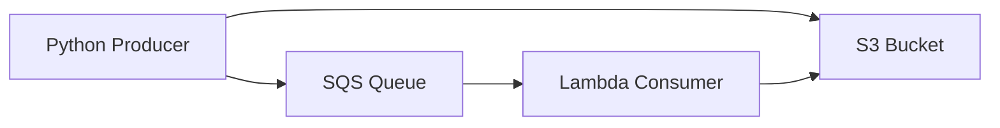

# Claim Check

Claim Check stores large payloads outside the queue and sends only a lightweight reference in the message. In AWS, the payload usually goes to S3 while SQS carries the S3 key.

## Problem it solves

Use Claim Check when event payloads are too large or too expensive to push directly through queues. A tiny reference message keeps the queue fast while the full payload sits in object storage.

It is not a fit when consumers require fully self-contained messages with no external lookups.

## When to use

- Payload size may exceed practical queue limits.
- You want cheaper queue usage for large bodies.
- You need durable storage for payloads that may be reprocessed later.

## Basic flow

1. Producer writes the full payload to S3.
2. Producer sends a small SQS message containing the bucket/key reference.
3. Consumer receives the reference message from SQS.
4. Consumer fetches the full payload from S3 and processes it.

## What happens in AWS

- S3 holds the large payload efficiently.
- SQS carries only metadata, which reduces queue pressure.
- Lambda can poll SQS and fetch payloads on demand from S3.
- Retries replay only the reference message while reusing the same stored object.

## Message shape

The queue message is intentionally lightweight:

```json
{
  "orderId": "order-123",
  "bucket": "claim-check-bucket",
  "key": "orders/order-123.json"
}
```

The full business payload lives in the S3 object at that key.

## Mermaid diagram



## Example code

The `example/` folder uses Python because the two-step flow (write object + send pointer) is easiest to show with concise scripts.

The `cdk/` folder uses AWS CDK in TypeScript to provision the S3 bucket, SQS queue, and Lambda consumer.

### Example snippets

```python
def publish_claim_check(s3_client, sqs_client, bucket: str, queue_url: str, order_id: str, payload: dict) -> None:
	key = f"orders/{order_id}.json"
	s3_client.put_object(Bucket=bucket, Key=key, Body=json.dumps(payload).encode("utf-8"))
	message = {"orderId": order_id, "bucket": bucket, "key": key}
	sqs_client.send_message(QueueUrl=queue_url, MessageBody=json.dumps(message))
```

```python
def handler(event, context):
	for record in event.get("Records", []):
		ref = json.loads(record["body"])
		obj = s3_client.get_object(Bucket=ref["bucket"], Key=ref["key"])
		payload = json.loads(obj["Body"].read().decode("utf-8"))
		print(f"processed claim-check payload for {payload['orderId']}")
	return {"statusCode": 200, "body": "processed"}
```

### CDK snippet

```ts
const bucket = new s3.Bucket(this, 'ClaimCheckBucket');
const queue = new sqs.Queue(this, 'ClaimCheckQueue');

const consumer = new lambda.Function(this, 'ClaimCheckConsumer', {
	runtime: lambda.Runtime.PYTHON_3_12,
	handler: 'consumer.handler',
	code: lambda.Code.fromAsset('../example'),
	environment: { BUCKET_NAME: bucket.bucketName },
});

queue.grantConsumeMessages(consumer);
bucket.grantRead(consumer);
consumer.addEventSource(new SqsEventSource(queue));
```

## Why it fits AWS well

- S3 is inexpensive and durable for large objects.
- SQS remains efficient with small messages.
- Lambda integrates cleanly with both SQS and S3.

## Failure handling

- Ensure object writes succeed before sending the reference message.
- Consider TTL/lifecycle policy for old payload objects in S3.
- Handle missing objects gracefully if data is deleted too early.
- Keep reference messages idempotent so retries are safe.

## Security and observability

- Producer needs `s3:PutObject` and `sqs:SendMessage`.
- Consumer needs `sqs:ReceiveMessage/DeleteMessage` and `s3:GetObject`.
- Log order id, bucket, and key for traceability.
- Avoid placing sensitive data in the queue message body.

## Tradeoffs

- Adds an extra network hop to fetch payloads from S3.
- Requires coordinated lifecycle management between queue retries and object retention.
- Increases architectural complexity compared to direct small messages.

## Try it locally

1. Run the Python tests in `example/`.
2. Run `npm test -- --runInBand` in `cdk/`.
3. Use `cdk synth` to inspect the generated infrastructure before deployment.
