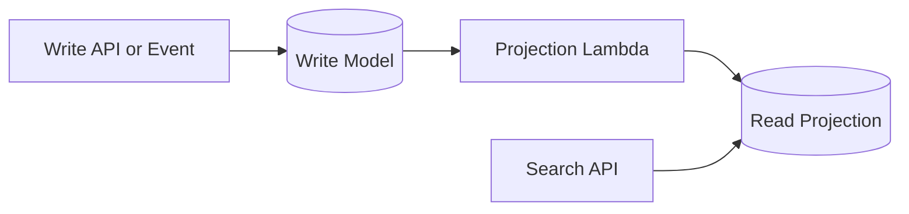

# CQRS Read Side Search Offloading

CQRS Read Side / Search Offloading separates the write model from a read-optimized projection. Writes update the source-of-truth model, and a separate read-side index or projection serves query-heavy or search-heavy traffic without burdening the transactional store.

## Problem it solves

Use this pattern when the same datastore is struggling to serve both transactional writes and flexible read/search queries. Search and reporting often need different access paths than the write model, and forcing both onto one schema can increase cost, latency, and complexity.

It is not ideal when the application is small and one datastore can comfortably serve both reads and writes.

## When to use

- Writes and read/search workloads have different access patterns.
- Search queries need denormalized or keyword-friendly data.
- You want read-side scaling without affecting write throughput.
- Eventual consistency between write and read models is acceptable.

## Basic flow

1. A write-side update arrives for a product.
2. The write model stores the canonical record.
3. A projection step updates the read-side search index.
4. Read APIs query the projection instead of the write store.

## What happens in AWS

- DynamoDB can hold the write model for transactional updates.
- A second table or OpenSearch index can serve read/search queries.
- Lambda updates the projection when write-side changes occur.
- API Gateway and Lambda expose read-side queries separately from writes.

## Message shape

Write event:

```json
{
	"productId": "p-101",
	"title": "Gaming Laptop",
	"category": "Electronics"
}
```

Read-side projection:

```json
{
	"productId": "p-101",
	"searchText": "gaming laptop electronics"
}
```

## Mermaid diagram



## Example code

The `example/` folder uses Python to show a write-side update, projection creation, and read-side search query.

The `cdk/` folder uses AWS CDK in TypeScript to provision separate write and search tables plus a search API.

### Example snippets

```python
def update_write_model(event: dict) -> dict:
		WRITE_STORE[event["productId"]] = {
				"productId": event["productId"],
				"title": event["title"],
				"category": event["category"],
		}
		return WRITE_STORE[event["productId"]]
```

```python
def project_to_search_index(event: dict) -> dict:
		SEARCH_INDEX[event["productId"]] = {
				"productId": event["productId"],
				"searchText": f"{event['title']} {event['category']}".lower(),
		}
		return SEARCH_INDEX[event["productId"]]
```

### CDK snippet

```ts
const writeTable = new dynamodb.Table(this, 'WriteModelTable', {
	partitionKey: { name: 'productId', type: dynamodb.AttributeType.STRING },
	billingMode: dynamodb.BillingMode.PAY_PER_REQUEST,
});

const searchTable = new dynamodb.Table(this, 'SearchProjectionTable', {
	partitionKey: { name: 'productId', type: dynamodb.AttributeType.STRING },
	billingMode: dynamodb.BillingMode.PAY_PER_REQUEST,
});
```

## Why it fits AWS well

- DynamoDB scales well for write-heavy and projection-heavy workloads.
- OpenSearch or a separate table can optimize the read/search path independently.
- Lambda is a simple place to project write events into read models.

## Failure handling

- Treat projection updates as retryable and idempotent.
- Monitor lag between write updates and read projection freshness.
- Be explicit about eventual consistency in APIs and documentation.
- Replay write events to rebuild projections when needed.

## Security and observability

- Separate IAM permissions for write and read paths.
- Monitor projection failures and stale-read lag.
- Track search latency separately from write latency.
- Log `productId` and projection updates for traceability.

## Tradeoffs

- You maintain more infrastructure and data duplication.
- Read-side results may lag behind the write model.
- Schema evolution must keep write and projection logic in sync.

## Try it locally

1. Run the Python tests in `example/`.
2. Run `npm install` and `npm test -- --runInBand` in `cdk/`.
3. Use `npm run cdk -- synth` to inspect the generated infrastructure.
