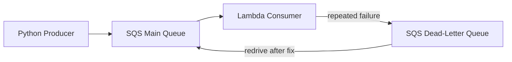

# DLQ + Redrive

DLQ + Redrive is the pattern for isolating poison messages from normal traffic. A primary SQS queue handles the main workload, and a dead-letter queue captures messages that keep failing after a configured number of retries.

## Problem it solves

Use DLQ + Redrive when a small set of bad messages should not block the rest of the queue. The primary queue can keep moving while failed messages are quarantined for later inspection or replay.

It is not a substitute for fixing the underlying bug. If the consumer always fails, redriving the message without a code change only repeats the failure.

## When to use

- You want to isolate poison messages.
- You need to inspect or replay failed work later.
- You want the main queue to stay healthy even when a few messages are bad.

## Basic flow

1. A producer sends work to the main SQS queue.
2. The Lambda consumer processes messages from that queue.
3. If processing keeps failing, the message exceeds `maxReceiveCount`.
4. SQS moves the message to the dead-letter queue.
5. After the issue is fixed, an operator can redrive the message back to the main queue.

## What happens in AWS

- The redrive policy controls how many times SQS retries a message before moving it to the DLQ.
- The DLQ stores failed messages separately so they do not block healthy traffic.
- Operators can inspect the DLQ for bad payloads, schema drift, or application defects.
- Once the root cause is fixed, DLQ messages can be replayed back to the source queue.

## Message shape

The example uses a simple job payload:

```json
{
  "jobId": "job-123",
  "action": "process-report"
}
```

If the message body contains `forceFail: true`, the sample consumer raises an error so the message eventually lands in the DLQ.

## Mermaid diagram



## Example code

The `example/` folder uses Python because the consumer behavior is small and easy to show with a simple success path plus a poison-message branch.

The `cdk/` folder uses AWS CDK in TypeScript to provision the main queue, DLQ, and Lambda consumer.

### Example snippets

```python
def enqueue_work(sqs_client, queue_url: str, job_id: str, force_fail: bool = False) -> None:
	payload = {"jobId": job_id, "action": "process-report"}
	if force_fail:
		payload["forceFail"] = True
	sqs_client.send_message(QueueUrl=queue_url, MessageBody=json.dumps(payload))
```

```python
def handler(event, context):
	for record in event.get("Records", []):
		body = json.loads(record["body"])
		if body.get("forceFail"):
			raise ValueError("forced failure for DLQ demo")
		print(f"processed job: {body['jobId']}")
	return {"statusCode": 200, "body": "processed"}
```

### CDK snippet

```ts
const deadLetterQueue = new sqs.Queue(this, 'DeadLetterQueue');
const queue = new sqs.Queue(this, 'PrimaryQueue', {
	visibilityTimeout: Duration.seconds(60),
	deadLetterQueue: {
		queue: deadLetterQueue,
		maxReceiveCount: 3,
	},
});

const consumer = new lambda.Function(this, 'DlqConsumer', {
	runtime: lambda.Runtime.PYTHON_3_12,
	handler: 'consumer.handler',
	code: lambda.Code.fromAsset('../example'),
});

consumer.addEventSource(new SqsEventSource(queue));
```

## Why it fits AWS well

- SQS natively supports dead-letter queues and redrive policies.
- Lambda and SQS combine well for retry-based processing.
- The pattern gives you a clear operational boundary between healthy and failed work.

## Failure handling

- Set `maxReceiveCount` low enough to avoid endless retries, but high enough for transient issues.
- Use the DLQ to inspect malformed payloads and recurring application errors.
- Redrive only after the root cause is fixed.
- Make the consumer idempotent so replay does not create duplicate side effects.

## Security and observability

- The producer needs permission to send to the main queue.
- The consumer needs permission to read from the main queue and write logs.
- Operators should watch DLQ depth, queue age, and Lambda errors.
- Treat DLQ payloads as operational data and avoid leaking secrets into them.

## Tradeoffs

- A DLQ hides failure from the main flow, so it can delay detection if you do not monitor it.
- Redrive is operational work, not automatic healing.
- Messages may fail again after replay if the underlying issue is not resolved.

## Try it locally

1. Run the Python tests in `example/`.
2. Run `npm test -- --runInBand` in `cdk/`.
3. Use `cdk synth` to inspect the generated infrastructure before deployment.
