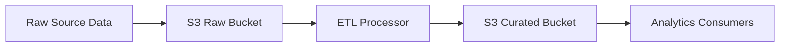

# ETL Data Lake

ETL / Data Lake moves raw data into centralized storage, transforms it into curated formats, and makes it available for analytics, reporting, or downstream machine workloads. The raw landing zone preserves original events, while curated outputs reshape the data for efficient querying.

## Problem it solves

Use this pattern when operational data needs to be stored beyond transactional systems and then cleaned, standardized, or enriched for analytics. It separates raw ingestion from curated analytical consumption so the source systems stay focused on business transactions.

It is not ideal when the dataset is tiny and simple exports are enough.

## When to use

- You need a raw landing zone plus a curated analytical view.
- Data from multiple sources needs standardization.
- Analytics workloads should not query transactional stores directly.
- You want replayable raw data with repeatable transformations.

## Basic flow

1. Raw records land in a raw storage tier.
2. An ETL step reads and transforms the records.
3. Curated outputs are written to a separate storage tier.
4. Downstream analytics or search consumers read the curated dataset.

## What happens in AWS

- S3 commonly serves as both raw and curated data lake storage.
- Lambda or Glue can run ETL transformations.
- The raw bucket preserves original payloads for replay.
- The curated bucket stores cleaned, normalized, or analytics-ready records.

## Message shape

Raw record:

```json
{
	"order_id": "o-1",
	"amount": 1250,
	"country": "us"
}
```

Curated record:

```json
{
	"order_id": "o-1",
	"amount": 1250.0,
	"country": "US",
	"amount_bucket": "large"
}
```

## Mermaid diagram



## Example code

The `example/` folder uses Python to show a raw-to-curated record transformation with simple bucketing logic.

The `cdk/` folder uses AWS CDK in TypeScript to provision raw and curated S3 buckets plus an ETL Lambda.

### Example snippets

```python
def transform_record(record: dict) -> dict:
		return {
				"order_id": record["order_id"],
				"amount": float(record["amount"]),
				"country": record["country"].upper(),
				"amount_bucket": "large" if float(record["amount"]) >= 1000 else "standard",
		}
```

```python
def run_etl(raw_records: list[dict]) -> dict:
		curated = [transform_record(record) for record in raw_records]
		return {
				"rawCount": len(raw_records),
				"curatedCount": len(curated),
				"records": curated,
		}
```

### CDK snippet

```ts
const rawBucket = new s3.Bucket(this, 'RawDataBucket');
const curatedBucket = new s3.Bucket(this, 'CuratedDataBucket');

const etlFn = new lambda.Function(this, 'EtlProcessorFn', {
	runtime: lambda.Runtime.PYTHON_3_12,
	handler: 'lambda_handler.handler',
	code: lambda.Code.fromAsset('../example'),
});
```

## Why it fits AWS well

- S3 is durable and cost-effective for both raw and curated storage.
- Lambda and Glue provide managed transformation options.
- The model supports replay, partitioning, and long-term retention cleanly.

## Failure handling

- Preserve raw data so failed transforms can be replayed.
- Make transforms deterministic and idempotent.
- Track ETL counts and bad-record handling explicitly.
- Separate raw and curated retention policies to avoid accidental data loss.

## Security and observability

- Restrict write access carefully between raw and curated tiers.
- Encrypt buckets and control access paths with IAM and bucket policies.
- Monitor ETL failure counts, runtime, and throughput.
- Log record counts and transformation outcomes for traceability.

## Tradeoffs

- Data duplication increases storage volume.
- Curated outputs may lag behind raw arrival time.
- Schema evolution in upstream data requires transformation maintenance.

## Try it locally

1. Run the Python tests in `example/`.
2. Run `npm install` and `npm test -- --runInBand` in `cdk/`.
3. Use `npm run cdk -- synth` to inspect the generated infrastructure.
