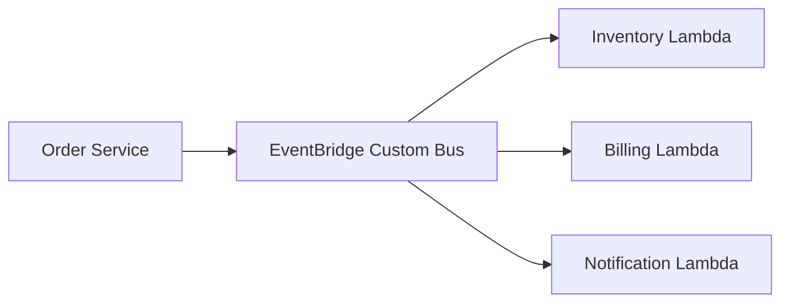

# Event Bus Choreography

Event Bus Choreography is a decentralized event-driven pattern where services react to business events without a central orchestrator controlling each step. A producer publishes an event once, and independent consumers subscribe to the event type they care about.

## Problem it solves

Use this pattern when multiple services need to react to the same business event, but you do not want one workflow controller to coordinate every action. It reduces direct service-to-service coupling and lets teams evolve consumers independently.

It is not a good fit when one step must explicitly decide whether the next step is allowed to run.

## When to use

- Multiple services react to the same event independently.
- Teams own separate downstream behaviors.
- You want loose coupling between producer and consumers.
- You want rule-based routing without shared queue ownership.

## Basic flow

1. An order service publishes an `OrderCreated` event to an event bus.
2. EventBridge matches the event against routing rules.
3. Inventory, billing, and notification consumers each receive the event.
4. Each consumer handles its own logic without coordinating through a central controller.

## What happens in AWS

- EventBridge custom buses accept business events from producers.
- EventBridge rules route matching events to the right targets.
- Lambda consumers process the routed events independently.
- Failures remain local to each consumer path rather than blocking the whole fan-out.

## Message shape

Sample event:

```json
{
	"source": "app.orders",
	"detail-type": "OrderCreated",
	"detail": {
		"orderId": "order-201",
		"totalAmount": 75.5
	}
}
```

## Mermaid diagram



## Example code

The `example/` folder uses Python to show one event being dispatched to multiple domain consumers.

The `cdk/` folder uses AWS CDK in TypeScript to provision the EventBridge bus, routing rules, and Lambda consumers.

### Example snippets

```python
def dispatch_event(event: dict) -> list[dict]:
		return [
				inventory_service(event),
				billing_service(event),
				notification_service(event),
		]
```

```python
def billing_service(event: dict) -> dict:
		detail = event["detail"]
		return {
				"service": "billing",
				"status": "INVOICED",
				"orderId": detail["orderId"],
				"amount": detail["totalAmount"],
		}
```

### CDK snippet

```ts
new events.Rule(this, 'BillingRule', {
	eventBus,
	eventPattern: {
		source: ['app.orders'],
		detailType: ['OrderCreated'],
	},
	targets: [new targets.LambdaFunction(billingFn)],
});
```

## Why it fits AWS well

- EventBridge is built for event routing across loosely coupled services.
- Rules let you add new consumers without changing the producer.
- Lambda makes each subscriber lightweight and independently deployable.

## Failure handling

- Make each consumer idempotent because events may be retried.
- Add DLQs or failure destinations for consumer-specific recovery.
- Version event payloads carefully so new consumers do not break old ones.
- Monitor per-rule invocation failures, not just overall publish success.

## Security and observability

- Producers need permission to put events onto the custom bus.
- Consumers need only the permissions required for their own work.
- CloudWatch metrics and logs provide rule-level and consumer-level visibility.
- Use correlation IDs or `orderId` for tracing across subscribers.

## Tradeoffs

- End-to-end flow becomes harder to reason about than in an orchestrated workflow.
- Eventual consistency means consumers can complete at different times.
- Debugging cross-service behavior requires disciplined logging and event tracing.

## Try it locally

1. Run the Python tests in `example/`.
2. Run `npm install` and `npm test -- --runInBand` in `cdk/`.
3. Use `npm run cdk -- synth` to inspect the generated infrastructure.
