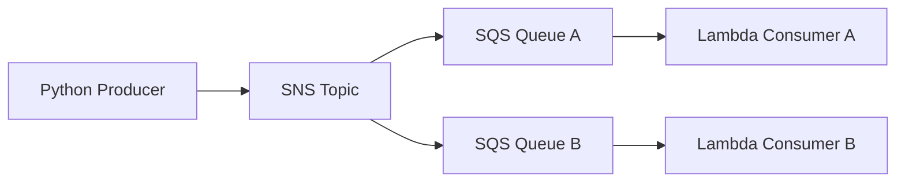

# Fan-Out

Fan-Out is a publish-once, process-many pattern. One producer sends a single event to an SNS topic, and that topic forwards the message to multiple SQS queues so each consumer can process the event independently.

## Problem it solves

Use Fan-Out when one business event needs to drive multiple independent workflows without forcing those workflows to share a runtime, queue, or retry policy. It is a fit for notification, enrichment, audit, analytics, and downstream integration flows.

It is not a good fit when one consumer must synchronously wait for another, or when all work belongs in one linear workflow.

## When to use

- You want one event to trigger multiple downstream workflows.
- Consumers should scale or fail independently.
- You want buffering and retry isolation between subscribers.

## Basic flow

1. A producer publishes an event to SNS.
2. SNS fans the event out to multiple SQS queues.
3. Each queue has its own Lambda consumer.
4. Consumers process the same message in different ways without blocking each other.

## What happens in AWS

- SNS owns the broadcast step and delivers the same event to every subscribed queue.
- SQS buffers each subscriber independently, so one slow consumer does not block the others.
- Lambda polls each queue and scales per queue rather than sharing throughput across consumers.
- Retries stay isolated to the queue that failed, which keeps a bad consumer from affecting the rest of the system.

## Message shape

The sample publisher sends a simple order event:

```json
{
	"orderId": "order-123",
	"eventType": "OrderCreated"
}
```

That shape is intentionally small so the README stays focused on the pattern rather than on domain modeling.

## Mermaid diagram



## Example code

The `example/` folder uses Python to show a simple publisher and two Lambda-style consumers.

The `cdk/` folder uses AWS CDK in TypeScript to provision the SNS topic, SQS queues, subscriptions, and Lambda consumers.

### Example snippets

```python
def publish_event(sns_client, topic_arn: str, order_id: str) -> None:
	payload = f'{{"orderId": "{order_id}", "eventType": "OrderCreated"}}'
	sns_client.publish(TopicArn=topic_arn, Message=payload, Subject="OrderCreated")
```

```python
def handler(event, context):
	for record in event["Records"]:
		print(f"queue-a received: {record['body']}")
```

### CDK snippet

```ts
const topic = new sns.Topic(this, 'FanOutTopic');
const queueA = new sqs.Queue(this, 'QueueA');
const queueB = new sqs.Queue(this, 'QueueB');

topic.addSubscription(new subs.SqsSubscription(queueA));
topic.addSubscription(new subs.SqsSubscription(queueB));
```

## Why it fits AWS well

- SNS gives native fan-out delivery.
- SQS buffers each consumer independently.
- Lambda keeps the consumer side simple and elastic.

## Failure handling

- Make consumers idempotent because SNS and SQS retries can produce duplicate processing.
- Add DLQs when a queue should stop retrying poison messages.
- Use alarms for queue depth and Lambda errors so you can detect a stalled subscriber early.
- Keep the message payload stable or versioned so one consumer can evolve without breaking the others.

## Security and observability

- The publisher needs permission to publish to the SNS topic.
- The topic needs permission to send to each SQS queue.
- Each Lambda needs permission to read from its queue and write logs.
- CloudWatch logs and queue depth metrics are the main signals to watch in production.

## Tradeoffs

- Messages are duplicated across queues, so cost and storage grow with each subscriber.
- Consumers should be idempotent because retries can happen.
- You need to manage queue permissions and subscription wiring carefully.

## Try it locally

1. Run the Python tests in `example/`.
2. Run `npm test -- --runInBand` in `cdk/`.
3. Use `cdk synth` to inspect the generated infrastructure before deployment.
