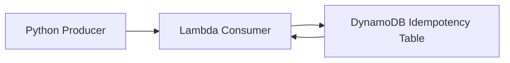

# Idempotency via Conditional Writes

Idempotency via Conditional Writes prevents duplicate processing by storing a record of work that has already been handled. A consumer writes a processing marker to DynamoDB with a conditional expression, and only the first write succeeds.

## Problem it solves

Use this pattern when retries, duplicate deliveries, or user replays could cause the same action to run more than once. The conditional write gives you a simple guardrail around side effects.

It is not enough by itself if the side effect already happened before the idempotency check. The idempotency record must be written before or alongside the irreversible action.

## When to use

- Messages or requests can arrive more than once.
- Duplicate execution would cause incorrect charges, duplicate emails, or repeated updates.
- You want a cheap, reliable first-line defense against replay.

## Basic flow

1. A producer sends a job with a stable idempotency key.
2. The consumer tries to write that key to DynamoDB.
3. The conditional write succeeds only if the key does not already exist.
4. If the key already exists, the consumer skips the duplicate work.

## What happens in AWS

- DynamoDB supports `attribute_not_exists` so the first writer wins.
- Lambda or other consumers can use that conditional write before doing the irreversible part of the job.
- If a duplicate arrives, the write fails fast and the consumer can return success without repeating the side effect.
- The idempotency table becomes a lightweight audit of processed work.

## Message shape

The sample uses a simple order event:

```json
{
  "orderId": "order-123",
  "eventType": "OrderCreated"
}
```

The `orderId` is the idempotency key in the example.

## Mermaid diagram



## Example code

The `example/` folder uses Python because the pattern is easiest to understand with a short producer plus a Lambda-style consumer that does a single conditional write.

The `cdk/` folder uses AWS CDK in TypeScript to provision the DynamoDB table and the Lambda consumer.

### Example snippets

```python
def enqueue_event(sqs_client, queue_url: str, order_id: str) -> None:
	payload = f'{{"orderId": "{order_id}", "eventType": "OrderCreated"}}'
	sqs_client.send_message(QueueUrl=queue_url, MessageBody=payload)
```

```python
def handler(event, context):
	for record in event.get("Records", []):
		body = json.loads(record["body"])
		order_id = body["orderId"]
		try:
			ddb_client.put_item(
				TableName=IDEMPOTENCY_TABLE,
				Item={"idempotencyKey": {"S": order_id}},
				ConditionExpression="attribute_not_exists(idempotencyKey)",
			)
		except ddb_client.exceptions.ConditionalCheckFailedException:
			print(f"duplicate ignored: {order_id}")
			continue
		print(f"processed once: {order_id}")
	return {"statusCode": 200, "body": "processed"}
```

### CDK snippet

```ts
const table = new dynamodb.Table(this, 'IdempotencyTable', {
	partitionKey: { name: 'idempotencyKey', type: dynamodb.AttributeType.STRING },
	removalPolicy: cdk.RemovalPolicy.DESTROY,
});

const consumer = new lambda.Function(this, 'IdempotencyConsumer', {
	runtime: lambda.Runtime.PYTHON_3_12,
	code: lambda.Code.fromAsset('../example'),
	handler: 'consumer.handler',
});

table.grantWriteData(consumer);
```

## Why it fits AWS well

- DynamoDB gives a very small, fast conditional-write primitive.
- Lambda consumers can cheaply reject duplicates before doing real work.
- The pattern fits well with event-driven systems where retries are expected.

## Failure handling

- Make the idempotency key stable across retries.
- Write the idempotency record before the irreversible side effect when possible.
- Return success for true duplicates so the caller does not keep retrying work that already finished.
- Watch for partial failures where the write succeeded but the external side effect did not.

## Security and observability

- The consumer needs permission to write to the DynamoDB table.
- CloudWatch logs should show the idempotency key and the duplicate decision.
- Track duplicate counts so you can see whether retries are normal or excessive.
- Avoid storing sensitive payloads in the idempotency table.

## Tradeoffs

- You add a table lookup or write to every request.
- The pattern only protects the code path that uses it; it does not magically fix all duplicates.
- If the key choice is too coarse, legitimate retries can be treated as duplicates.

## Try it locally

1. Run the Python tests in `example/`.
2. Run `npm test -- --runInBand` in `cdk/`.
3. Use `cdk synth` to inspect the generated infrastructure before deployment.
