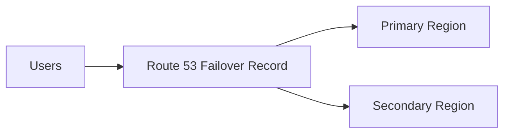

# Multi Region Failover

Multi-Region Failover keeps an application available during regional outages by routing traffic to a healthy secondary region when primary health checks fail.

## Problem it solves

Single-region architectures can become unavailable during regional incidents. Failover reduces downtime by switching clients to another region.

## When to use

- High availability targets require regional resilience.
- You can replicate state across regions.

## Basic flow

1. Deploy stacks in primary and secondary regions.
2. Route 53 health checks monitor primary endpoints.
3. DNS failover routes traffic to secondary when primary is unhealthy.

## Mermaid diagram

## Example code

Python example simulates endpoint selection based on health check states.

## Why it fits AWS well

- Route 53 supports active-passive and active-active policies.
- Global services pair naturally with regional workloads.

## Failure handling

- Validate failback behavior after primary recovers.

## Security and observability

- Monitor health checks, DNS routing changes, and replication lag.

## Tradeoffs

- Higher cost and operational complexity than single region.

## Try it locally

1. Run `pytest -q` in `example/`.
2. Run `npm install && npm test -- --runInBand` in `cdk/`.
