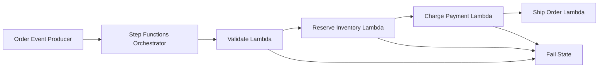

# Orchestrator Workflow

Orchestrator Workflow centralizes multi-step business flow in one workflow engine. A controller (typically Step Functions) invokes each step in order, applies retries and branching rules, and decides whether to continue, fail, or compensate.

## Problem it solves

Use this pattern when a process spans multiple services and you need explicit control over sequencing, failure paths, and visibility into each step. It avoids hidden coupling where services call each other directly and error handling becomes fragmented.

It is not ideal for very small workflows where one synchronous handler is enough.

## When to use

- You have a multi-step business transaction across service boundaries.
- You need centralized retry, timeout, and branch control.
- You want workflow state visible for debugging and operations.
- You need consistent failure handling at each step.

## Basic flow

1. A producer emits an order event.
2. The orchestrator validates the payload.
3. The orchestrator reserves inventory.
4. The orchestrator charges payment.
5. The orchestrator ships the order on success, or exits through a failure path.

## What happens in AWS

- Step Functions runs the state machine and tracks workflow state.
- Lambda implements each workflow step as an independent task.
- Choice states branch based on each step result (`OK` or `FAILED`).
- Fail states stop the workflow with explicit error semantics.

## Message shape

Input event:

```json
{
	"orderId": "order-101",
	"totalAmount": 149.99,
	"currency": "USD",
	"inventoryAvailable": true,
	"paymentAuthorized": true
}
```

Success result:

```json
{
	"status": "SUCCEEDED",
	"orderId": "order-101",
	"shipmentId": "ship-order-101"
}
```

## Mermaid diagram



## Example code

The `example/` folder uses Python to show the orchestration logic and stage-by-stage outcomes.

The `cdk/` folder uses AWS CDK in TypeScript to provision the Step Functions state machine and Lambda task handlers.

### Example snippets

```python
reserved = reserve_inventory(validated)
if reserved["status"] != "OK":
		return reserved
```

```python
charged = charge_payment(reserved)
if charged["status"] != "OK":
		compensation = release_inventory(
				order_id=charged["orderId"],
				reservation_id=charged.get("reservationId"),
		)
		return {
				"status": "FAILED",
				"stage": "chargePayment",
				"reason": charged["reason"],
				"orderId": charged["orderId"],
				"compensation": compensation,
		}
```

### CDK snippet

```ts
const definition = validateTask
	.next(validateChoice)
	.next(reserveChoice)
	.next(paymentChoice)
	.next(success);

new sfn.StateMachine(this, 'OrderOrchestratorStateMachine', {
	definitionBody: sfn.DefinitionBody.fromChainable(definition),
	stateMachineName: 'order-orchestrator-workflow',
});
```

## Why it fits AWS well

- Step Functions provides visual workflow state and execution history.
- Native retries, catches, and branch transitions reduce custom orchestration code.
- Lambda tasks keep each workflow step isolated and independently deployable.

## Failure handling

- Validate required fields before state transitions.
- Stop workflow with explicit fail states when critical steps fail.
- Include compensation hooks where needed (for example release inventory on payment failure).
- Keep each step idempotent because retries can re-run tasks.

## Security and observability

- Grant Step Functions permission to invoke only required Lambda handlers.
- Apply least privilege to each Lambda role for downstream resources.
- Track Step Functions execution status and Lambda errors in CloudWatch.
- Include `orderId` and stage in logs for end-to-end tracing.

## Tradeoffs

- Central orchestration can become a coordination bottleneck if overused.
- Workflow definitions add upfront design and maintenance overhead.
- Complex state machines require versioning discipline and migration planning.

## Try it locally

1. Run the Python tests in `example/`.
2. Run `npm install` and `npm test -- --runInBand` in `cdk/`.
3. Use `npm run cdk -- synth` to inspect the generated infrastructure.
