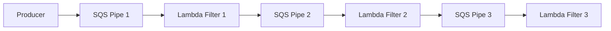

# Pipes and Filters

Pipes and Filters decomposes processing into small, independent steps. Each filter performs one transformation, and pipes carry the message from one step to the next.

## Problem it solves

Use this pattern when one large processing function becomes hard to maintain, test, or evolve. Breaking logic into staged filters improves isolation and supports stepwise retries.

It is not ideal for tiny workflows where one simple function is enough.

## When to use

- You have a multi-step transformation pipeline.
- Different steps need independent scaling or ownership.
- You want isolated retries for failing stages.

## Basic flow

1. A producer emits an input event.
2. Filter 1 validates and normalizes the event.
3. Filter 2 enriches the normalized message.
4. Filter 3 routes or finalizes output for downstream consumers.

## What happens in AWS

- SQS queues act as durable pipes between filters.
- Lambda functions implement each filter stage.
- Each stage can retry independently.
- Failures in one stage do not block upstream message intake.

## Message shape

Initial message:

```json
{
  "orderId": "order-123",
  "amount": 149.99,
  "currency": "usd"
}
```

After filtering and enrichment:

```json
{
  "orderId": "order-123",
  "amount": 149.99,
  "currency": "USD",
  "riskTier": "standard"
}
```

## Mermaid diagram



## Example code

The example uses Python because staged transformation logic is easy to read in small functions.

The CDK folder uses TypeScript to provision the SQS pipes and Lambda filters.

### Example snippets

```python
def normalize(message: dict) -> dict:
	return {
		"orderId": message["orderId"],
		"amount": float(message["amount"]),
		"currency": str(message["currency"]).upper(),
	}
```

```python
def enrich(message: dict) -> dict:
	risk_tier = "high" if message["amount"] >= 1000 else "standard"
	return {**message, "riskTier": risk_tier}
```

### CDK snippet

```ts
const pipe1 = new sqs.Queue(this, 'PipeQueue1');
const pipe2 = new sqs.Queue(this, 'PipeQueue2');
const pipe3 = new sqs.Queue(this, 'PipeQueue3');
```

## Why it fits AWS well

- Lambda naturally maps to independent filter stages.
- SQS provides buffering and retry isolation between stages.
- Each filter can scale and deploy independently.

## Failure handling

- Add DLQs per stage for poison messages.
- Keep each filter idempotent due to retries.
- Use contract validation at each stage boundary.
- Monitor queue age to detect stuck pipeline segments.

## Security and observability

- Grant each filter least-privilege permissions to only its queues.
- Log stage names and message IDs for traceability.
- Track queue depth, Lambda errors, and duration per stage.
- Consider X-Ray or trace correlation IDs across filters.

## Tradeoffs

- More infrastructure components than a single handler.
- Schema evolution requires stage compatibility management.
- End-to-end latency can increase across multiple hops.

## Try it locally

1. Run the Python tests in `example/`.
2. Run `npm test -- --runInBand` in `cdk/`.
3. Use `cdk synth` to inspect the generated infrastructure before deployment.
