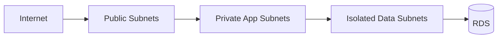

# Private Networking Data Tier

Private Networking for Data Tier places databases and other sensitive data services on private network paths so they are reachable only from approved application tiers. The goal is to keep the data plane off the public internet and enforce access through subnet boundaries, security groups, and controlled endpoints.

## Problem it solves

Use this pattern when application services need access to a database, cache, or internal data service that should never be exposed publicly. It reduces attack surface and forces access through known private routes.

It is not ideal for very small prototypes where the networking overhead outweighs the security benefit.

## When to use

- Your database should not have a public endpoint.
- Application and data tiers need strict network separation.
- You want least-privilege network access between tiers.
- Compliance or security requirements require private-only data paths.

## Basic flow

1. An application runs in private application subnets.
2. The database runs in isolated private data subnets.
3. Security groups allow only approved app-tier traffic to the database port.
4. Public internet traffic cannot directly reach the data tier.

## What happens in AWS

- A VPC provides network isolation.
- Private application subnets host Lambda, ECS, or EC2 app workloads.
- Isolated private subnets host RDS or other data services.
- Security groups and route tables enforce which tiers can communicate.

## Message shape

This pattern is primarily network-topology focused. The example uses a simple access request decision payload:

```json
{
	"sourceSubnetType": "private",
	"securityGroupAccess": true
}
```

Result:

```json
{
	"sourceSubnetType": "private",
	"securityGroupAccess": true,
	"allowed": true,
	"reason": "private path allowed"
}
```

## Mermaid diagram



## Example code

The `example/` folder uses Python to show the access-control decision in a compact way.

The `cdk/` folder uses AWS CDK in TypeScript to provision a VPC, private app subnets, isolated data subnets, a Lambda app tier, and an RDS data tier.

### Example snippets

```python
def can_reach_data_tier(source_subnet_type: str, has_security_group_access: bool) -> bool:
		return source_subnet_type == "private" and has_security_group_access
```

```python
def describe_connection(source_subnet_type: str, has_security_group_access: bool) -> dict:
		allowed = can_reach_data_tier(source_subnet_type, has_security_group_access)
		return {
				"sourceSubnetType": source_subnet_type,
				"securityGroupAccess": has_security_group_access,
				"allowed": allowed,
				"reason": "private path allowed" if allowed else "public or unauthorized path blocked",
		}
```

### CDK snippet

```ts
const vpc = new ec2.Vpc(this, 'DataTierVpc', {
	subnetConfiguration: [
		{ name: 'public', subnetType: ec2.SubnetType.PUBLIC },
		{ name: 'private-app', subnetType: ec2.SubnetType.PRIVATE_WITH_EGRESS },
		{ name: 'private-data', subnetType: ec2.SubnetType.PRIVATE_ISOLATED },
	],
});
```

## Why it fits AWS well

- VPC primitives make tier isolation explicit and manageable.
- RDS, Lambda, and VPC endpoints integrate cleanly with private-only designs.
- Security groups provide fine-grained network authorization between tiers.

## Failure handling

- Ensure app-tier workloads have the required route and security-group access before deployment.
- Monitor connection failures to detect broken routes or SG rules.
- Use NAT or VPC endpoints intentionally so private workloads can still reach required AWS services.
- Test failover paths for private data services such as Multi-AZ RDS.

## Security and observability

- Keep the data tier in isolated subnets with no public exposure.
- Limit ingress to database ports from only approved app security groups.
- Use VPC flow logs, RDS logs, and application connection metrics for troubleshooting.
- Store credentials in Secrets Manager rather than embedding them in code.

## Tradeoffs

- VPC and subnet design adds operational complexity.
- Private workloads may need NAT gateways or endpoints, which adds cost.
- Misconfigured routes or SG rules can cause hard-to-debug connectivity issues.

## Try it locally

1. Run the Python tests in `example/`.
2. Run `npm install` and `npm test -- --runInBand` in `cdk/`.
3. Use `npm run cdk -- synth` to inspect the generated infrastructure.
