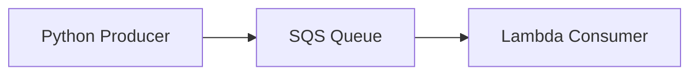

# Queue-Based Load Leveling

Queue-Based Load Leveling smooths traffic bursts by placing SQS between the producer and the consumer. The producer writes quickly, the queue absorbs spikes, and the consumer processes messages at a steady pace.

## Problem it solves

Use Queue-Based Load Leveling when producers are faster or more bursty than the downstream system. The queue absorbs the mismatch so the consumer does not fall over during spikes.

It is not the right fit when you need immediate synchronous feedback or when the work must be completed in the same request path.

## When to use

- You need to buffer bursty traffic.
- The downstream service has a limited processing rate.
- Temporary delays are acceptable as long as work is not lost.

## Basic flow

1. A producer sends work to an SQS queue.
2. The queue stores messages until the consumer is ready.
3. A Lambda consumer polls the queue and processes messages in batches.
4. The consumer scales up or down independently of the producer.

## What happens in AWS

- SQS decouples the producer from the consumer and provides durable buffering.
- Lambda polls SQS and can scale with queue depth.
- Visibility timeout protects in-flight work while the consumer is processing a message.
- If the consumer slows down, the queue grows instead of failing the producer immediately.

## Message shape

The sample uses a small order-processing payload:

```json
{
  "orderId": "order-123",
  "priority": "normal"
}
```

That is enough to show the buffering behavior without turning the example into a domain model.

## Mermaid diagram



## Example code

The `example/` folder uses Python because the pattern is simple and the core idea is easier to see in a small script plus a Lambda-style handler.

The `cdk/` folder uses AWS CDK in TypeScript to provision the SQS queue and the Lambda consumer.

### Example snippets

```python
def enqueue_work(sqs_client, queue_url: str, order_id: str) -> None:
	payload = f'{{"orderId": "{order_id}", "priority": "normal"}}'
	sqs_client.send_message(QueueUrl=queue_url, MessageBody=payload)
```

```python
def handler(event, context):
	for record in event["Records"]:
		print(f"processing queued work: {record['body']}")
	return {"statusCode": 200, "body": "processed"}
```

### CDK snippet

```ts
const queue = new sqs.Queue(this, 'LoadLevelingQueue', {
	visibilityTimeout: Duration.seconds(60),
});

const consumer = new lambda_.Function(this, 'LoadLevelingConsumer', {
	runtime: lambda_.Runtime.PYTHON_3_12,
	code: lambda_.Code.fromAsset('../example'),
	handler: 'consumer.handler',
});

consumer.addEventSource(new SqsEventSource(queue));
```

## Why it fits AWS well

- SQS gives durable buffering with simple semantics.
- Lambda lets the consumer scale with demand instead of the producer.
- The pattern uses managed services instead of custom retry plumbing.

## Failure handling

- Use a DLQ if messages should stop retrying after repeated failures.
- Make the consumer idempotent because messages can be processed more than once.
- Tune the visibility timeout so in-flight work is not reprocessed too early.
- Watch queue depth and age of oldest message to spot slow consumers.

## Security and observability

- The producer needs permission to send messages to the queue.
- The consumer needs permission to receive and delete messages.
- CloudWatch metrics should track queue depth, age of oldest message, and Lambda errors.
- CloudWatch logs should show the message body or correlation id, not secrets.

## Tradeoffs

- The queue adds latency, so this is not suitable for synchronous user-facing paths.
- Bursts are absorbed instead of eliminated, so backlog can still build if the consumer stays slow.
- Messages can be duplicated, so the consumer must tolerate retries.

## Try it locally

1. Run the Python tests in `example/`.
2. Run `npm test -- --runInBand` in `cdk/`.
3. Use `cdk synth` to inspect the generated infrastructure before deployment.# Queue-Based Load Leveling

TODO: Describe the AWS Queue-Based Load Leveling pattern, example flow, and tradeoffs.
