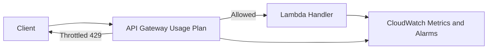

# Rate Limiting and Throttling

Rate limiting and throttling control how fast requests are accepted and processed. The goal is to protect shared services, preserve fairness across clients, and keep costs and latency predictable under bursty traffic.

## Problem it solves

Use this pattern when public or internal APIs can be overwhelmed by client spikes, retries, or abusive traffic. Without request controls, healthy clients can be impacted by noisy neighbors and downstream dependencies can cascade into failure.

It is not a good fit for low-traffic systems where hard throughput caps create more user friction than resilience value.

## When to use

- Your API has known backend capacity limits.
- Multiple consumers compete for the same endpoint.
- You need a controlled response (`429`) with retry guidance.
- You want protection against accidental traffic storms.

## Basic flow

1. A client sends a request to API Gateway.
2. API Gateway enforces stage and usage-plan limits.
3. If allowed, Lambda processes the request.
4. If limits are exceeded, the client gets `429 Too Many Requests` and retries with backoff.

## What happens in AWS

- API Gateway usage plans enforce per-key rate and burst limits.
- API Gateway stage throttling adds global protection.
- Lambda reserved concurrency can cap backend execution fan-out.
- CloudWatch alarms detect sustained 4XX and Lambda error rates.

## Message shape

Successful response:

```json
{
  "status": "success",
  "message": "Processed: order-123",
  "client": "mobile-client-a",
  "timestamp": 1753449301.21
}
```

Throttled response:

```json
{
  "error": "Rate limit exceeded",
  "retry_after": 0.42
}
```

## Mermaid diagram



## Example code

The `example/` folder uses Python and Flask to demonstrate token-bucket style per-client limits and 429 responses.

The `cdk/` folder uses AWS CDK in TypeScript to provision API Gateway throttling, Lambda handlers, an API key, and usage plan limits.

### Example snippets

```python
allowed, retry_after = limiter.allow_request(client_id)
if not allowed:
    return {"error": "Rate limit exceeded", "retry_after": retry_after}, 429
```

```python
class TokenBucket:
    def allow_request(self, tokens_needed: int = 1):
        self._refill()
        if self.tokens >= tokens_needed:
            self.tokens -= tokens_needed
            return True, int(self.tokens)
        return False, int(self.tokens)
```

### CDK snippet

```ts
const usagePlan = api.addUsagePlan("UsagePlan", {
  throttle: { rateLimit: 100, burstLimit: 200 },
  quota: { limit: 1_000_000, period: apigateway.Period.DAY },
});
```

## Why it fits AWS well

- API Gateway has first-class throttling controls.
- Usage plans and API keys support tenant-aware limits.
- CloudWatch provides built-in metrics for throttles, errors, and latency.

## Failure handling

- Return `Retry-After` for throttled clients.
- Use exponential backoff with jitter on the client side.
- Isolate abusive clients with key-level usage plans.
- Add alarms for sustained throttles and Lambda errors.

## Security and observability

- Use API keys or JWT identity to apply client-specific limits.
- Keep least-privilege IAM on Lambda roles.
- Track API Gateway 4XX and Lambda error/duration metrics.
- Include client ID and correlation IDs in logs.

## Tradeoffs

- Strict limits can reject valid traffic during spikes.
- Tuning burst vs steady-state rates requires real workload data.
- Client-side retries must be implemented correctly to avoid retry storms.

## Try it locally

1. Run `pip install -r requirements.txt` in `example/`.
2. Run `pytest` in `example/`.
3. Run `npm install` and `npm test -- --runInBand` in `cdk/`.
4. Use `npm run cdk -- synth` to inspect generated infrastructure.
