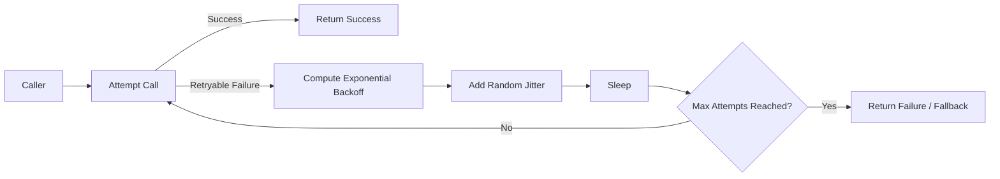

# Retry with Backoff Jitter

Retry with Backoff Jitter retries transient failures with increasing delay and randomization between attempts. The growing delay reduces pressure on a struggling dependency, and jitter prevents many clients from retrying at the exact same time.

## Problem it solves

Immediate retries can create synchronized retry storms that make outages worse. Backoff plus jitter smooths retry traffic and improves recovery probability for temporary network, throttling, or service disruptions.

Use this pattern for calls to remote APIs, queues, or databases where transient failure is common and safe retry is possible.

## When to use

- The dependency returns intermittent 429/5xx or timeout errors.
- The operation is idempotent or safely retryable.
- You want bounded retries before fallback or dead-letter handling.
- You need to reduce retry synchronization across many workers.

## Basic flow

1. Execute request attempt 1.
2. If success, return result.
3. On retryable failure, compute delay using exponential backoff.
4. Add jitter to randomize the delay.
5. Retry until success or max attempts reached.

## What happens in AWS

- Lambda callers and SDK clients apply retry policy for downstream services.
- SQS consumers and EventBridge targets often combine retries with DLQ behavior.
- Step Functions can model retries with `Retry` and configurable backoff rate.
- CloudWatch metrics track retry counts, latency impact, and terminal failures.

## Message shape

Request:

```json
{
	"requestId": "req-700",
	"operation": "submitOrder",
	"payload": {
		"orderId": "ord-1"
	}
}
```

Attempt log event:

```json
{
	"attempt": 3,
	"baseDelayMs": 400,
	"jitterMs": 73,
	"sleepMs": 473,
	"reason": "throttled"
}
```

Final response:

```json
{
	"status": "ok",
	"attempts": 3,
	"result": {
		"accepted": true
	}
}
```

## Mermaid diagram



## Example code

The `example/` folder contains a deterministic Python retry helper that computes backoff + jitter and tests success-after-retries, max-attempt failures, and non-retryable failures.

The `cdk/` folder provisions a simple AWS reference using Lambda and SQS with a DLQ, which is a common pairing for retry strategies.

### Example snippets

```python
base_delay = min(max_delay_ms, initial_delay_ms * (2 ** (attempt - 1)))
jitter = rng.randint(0, jitter_ms)
sleep_ms = base_delay + jitter
```

```python
if is_retryable(error) and attempt < max_attempts:
		wait = next_delay(attempt)
		events.append({"attempt": attempt, "sleepMs": wait})
		continue
raise
```

### CDK snippet

```ts
const dlq = new sqs.Queue(this, 'RetryDlq', {
	retentionPeriod: cdk.Duration.days(14),
});

const queue = new sqs.Queue(this, 'RetryQueue', {
	visibilityTimeout: cdk.Duration.seconds(30),
	deadLetterQueue: { queue: dlq, maxReceiveCount: 5 },
});
```

## Why it fits AWS well

- AWS SDKs and Step Functions have built-in retry primitives.
- SQS + DLQ provides durable handling when retries are exhausted.
- Lambda scales rapidly, so jitter helps avoid synchronized spikes.
- CloudWatch provides straightforward visibility into retry behavior.

## Failure handling

- Retry only on known transient errors.
- Enforce max attempts and overall timeout budget.
- Route terminal failures to DLQ or compensating flow.
- Keep operations idempotent to avoid duplicate side effects.

## Security and observability

- Do not log sensitive payload fields in retry events.
- Emit attempt number, delay, error type, and terminal status.
- Alert on sustained high retry rate or DLQ growth.
- Correlate retries with dependency latency and throttling metrics.

## Tradeoffs

- Retries increase end-to-end latency.
- Poor tuning can still overload dependencies.
- Non-idempotent operations can produce duplicates.
- Additional policy logic increases complexity.

## Try it locally

1. Run `pytest -q` in `example/`.
2. Run `npm install` and `npm test -- --runInBand` in `cdk/`.
3. Run `npm run cdk -- synth` to inspect generated infrastructure.
