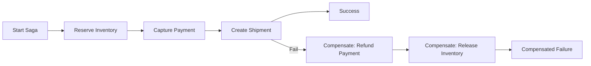

# Saga with Compensation

Saga with Compensation coordinates a multi-step distributed workflow where each successful step has a matching undo action. If a later step fails, compensation runs in reverse order to restore consistency.

## Problem it solves

In microservices systems, there is no single ACID transaction across services, queues, and external APIs. Partial success can leave data inconsistent. Saga breaks work into local transactions and uses compensating actions to recover on failure.

Use this pattern for multi-service business flows such as order placement, payment, inventory reservation, and shipping initiation.

## When to use

- One business operation spans multiple services or datastores.
- You need eventual consistency with explicit rollback semantics.
- Two-phase commit is impractical or too costly.
- Steps can define deterministic compensation behavior.

## Basic flow

1. Execute step 1 local transaction.
2. Execute next step only if previous step succeeded.
3. On failure, stop forward progress.
4. Execute compensations for completed steps in reverse order.
5. Emit final success or compensated-failure outcome.

## What happens in AWS

- Step Functions orchestrates the sequence and error handling.
- Lambda functions implement local actions and compensations.
- EventBridge can emit saga state-change events.
- DynamoDB (or other stores) tracks business state and idempotency.

## Message shape

Saga request:

```json
{
	"orderId": "ord-900",
	"customerId": "cust-11",
	"amount": 120.0,
	"sku": "sku-42"
}
```

Step result:

```json
{
	"step": "ReserveInventory",
	"status": "ok",
	"reservationId": "res-77"
}
```

Compensated failure:

```json
{
	"status": "compensated",
	"failedStep": "CreateShipment",
	"compensations": [
		"ReleaseInventory",
		"RefundPayment"
	]
}
```

## Mermaid diagram



## Example code

The `example/` folder includes a pure Python saga coordinator with step execution, reverse-order compensation, and tests for success, failure, and partial compensation behavior.

The `cdk/` folder contains an AWS CDK Step Functions state machine using Lambda tasks and catch paths to compensation states.

### Example snippets

```python
for step in steps:
		result = step.execute(context)
		completed.append(step)
```

```python
for step in reversed(completed):
		step.compensate(context)
```

### CDK snippet

```ts
const reserveTask = new tasks.LambdaInvoke(this, 'ReserveInventory', {
	lambdaFunction: reserveFn,
	outputPath: '$.Payload',
});
```

## Why it fits AWS well

- Step Functions gives explicit workflow, retries, and failure branches.
- Lambda enables isolated step ownership by service boundary.
- CloudWatch provides execution visibility and failure diagnostics.
- EventBridge integration supports downstream audit and monitoring.

## Failure handling

- Compensation must be idempotent and safe to rerun.
- Persist correlation IDs for each step and compensation.
- Timeouts and retries should be tuned per step.
- Treat compensation failure as a first-class incident path.

## Security and observability

- Minimize payload data passed between states.
- Apply least-privilege IAM for each Lambda step.
- Log step transitions with order and saga IDs.
- Track metrics: success rate, compensation rate, step latency.

## Tradeoffs

- More workflow complexity than simple request chains.
- Compensation may not perfectly restore all side effects.
- Debugging distributed timelines requires strong tracing.
- Requires disciplined contract design between services.

## Try it locally

1. Run `pytest -q` in `example/`.
2. Run `npm install` and `npm test -- --runInBand` in `cdk/`.
3. Run `npm run cdk -- synth` to inspect the state machine template.
