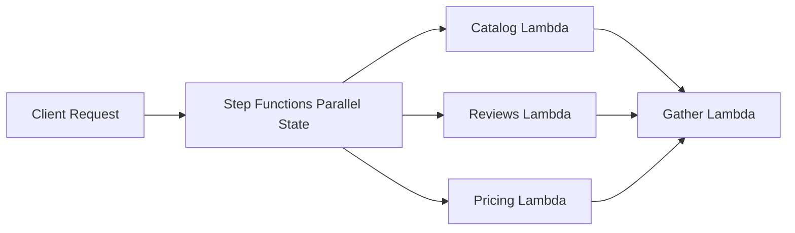

# Scatter Gather

Scatter Gather sends one request to multiple parallel workers, then combines the responses into one aggregated result. The scatter step fans work out concurrently, and the gather step waits for the branches that matter and merges their outputs.

## Problem it solves

Use this pattern when one client request depends on data or computation from several independent sources and you want lower overall latency than sequential calls would provide. It works well for search aggregation, pricing comparison, recommendation blending, and multi-service dashboards.

It is not a good fit when one branch must complete before another can start.

## When to use

- One request needs data from multiple services.
- Branches can run independently in parallel.
- You need one aggregated response back to the caller.
- End-to-end latency matters more than simple control flow.

## Basic flow

1. A caller sends a search request.
2. The scatter step fans the request out to catalog, reviews, and pricing workers.
3. Each worker returns its own result payload.
4. The gather step merges the branch responses into one final result.

## What happens in AWS

- Step Functions `Parallel` can launch multiple Lambda tasks at once.
- Lambda workers handle the branch-specific queries.
- A gather Lambda merges results into one response shape.
- The workflow returns one consolidated output while preserving branch isolation.

## Message shape

Input request:

```json
{
	"requestId": "req-301",
	"query": "camera"
}
```

Aggregated response:

```json
{
	"sources": ["catalog", "reviews", "pricing"],
	"results": [
		"catalog:camera:a",
		"catalog:camera:b",
		"reviews:camera:top",
		"pricing:camera:best-offer"
	],
	"resultCount": 4
}
```

## Mermaid diagram



## Example code

The `example/` folder uses Python to show three parallel service calls and a merge step.

The `cdk/` folder uses AWS CDK in TypeScript to provision a Step Functions workflow with a `Parallel` state and Lambda tasks.

### Example snippets

```python
def scatter(request: dict) -> list[dict]:
		return [
				catalog_service(request),
				reviews_service(request),
				pricing_service(request),
		]
```

```python
def gather(responses: list[dict]) -> dict:
		merged: list[str] = []
		for response in responses:
				merged.extend(response["results"])
		return {
				"sources": [response["source"] for response in responses],
				"results": merged,
				"resultCount": len(merged),
		}
```

### CDK snippet

```ts
const parallel = new sfn.Parallel(this, 'ScatterQueries')
	.branch(catalogTask)
	.branch(reviewsTask)
	.branch(pricingTask);

const definition = parallel.next(gatherTask).next(new sfn.Succeed(this, 'QueryComplete'));
```

## Why it fits AWS well

- Step Functions makes parallel branches explicit and observable.
- Lambda is a natural fit for short-lived branch workers.
- You can add or remove branches without rewriting the whole control flow.

## Failure handling

- Decide whether one failed branch should fail the whole response or degrade gracefully.
- Keep branch handlers idempotent for retries.
- Bound worker timeouts so one slow branch does not dominate latency.
- Capture partial-result behavior explicitly in the gather step if needed.

## Security and observability

- Grant Step Functions access only to the branch Lambdas it invokes.
- Give each worker least-privilege access to its own data source.
- Track branch duration and failure rates separately.
- Log the `requestId` across all branches to correlate parallel execution.

## Tradeoffs

- Aggregation logic becomes more complex than a single direct call.
- Parallel branches can increase total resource usage and cost.
- Slowest-branch latency still shapes the final response unless you add timeout or partial-result rules.

## Try it locally

1. Run the Python tests in `example/`.
2. Run `npm install` and `npm test -- --runInBand` in `cdk/`.
3. Use `npm run cdk -- synth` to inspect the generated infrastructure.
