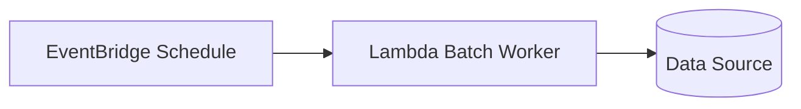

# Scheduled Batch

Scheduled Batch runs work on a fixed schedule instead of reacting to every request immediately. In AWS, EventBridge Scheduler (or EventBridge rules) triggers a Lambda at a cadence such as every 5 minutes or once per night.

## Problem it solves

Use this pattern when work does not need per-request real-time execution and can be grouped into periodic jobs. It helps smooth traffic, reduce per-event overhead, and align processing with reporting or downstream windows.

It is not ideal when users expect immediate results after an action.

## When to use

- You run recurring jobs such as report generation or cleanup.
- You aggregate or process records in time windows.
- You want predictable execution times (hourly, daily, weekly).

## Basic flow

1. A schedule is defined (for example, every 5 minutes).
2. EventBridge triggers a Lambda with a schedule event payload.
3. The Lambda fetches pending items for that window.
4. The Lambda processes the batch and records outcome.

## What happens in AWS

- EventBridge owns time-based triggering.
- Lambda runs the batch logic with built-in scaling and retries.
- CloudWatch captures execution logs and metrics.
- Failures can be retried or routed to DLQ/on-failure destinations.

## Message shape

Schedule events commonly include trigger metadata:

```json
{
  "id": "f0c7b3e5-xxxx",
  "source": "aws.events",
  "detail-type": "Scheduled Event",
  "time": "2025-02-28T12:00:00Z"
}
```

Batch processors often use the trigger time as the window boundary.

## Mermaid diagram



## Example code

The `example/` folder uses Python to keep batch logic small and readable.

The `cdk/` folder uses AWS CDK in TypeScript to provision EventBridge and Lambda wiring.

### Example snippets

```python
def select_pending(records: list[dict], max_items: int) -> list[dict]:
	return [r for r in records if r.get("status") == "PENDING"][:max_items]
```

```python
def handler(event, context):
	batch = select_pending(DATA_SOURCE, max_items=3)
	processed = [item["id"] for item in batch]
	print(f"scheduled run processed: {processed}")
	return {"processedIds": processed, "count": len(processed)}
```

### CDK snippet

```ts
const worker = new lambda.Function(this, 'ScheduledBatchWorker', {
	runtime: lambda.Runtime.PYTHON_3_12,
	handler: 'consumer.handler',
	code: lambda.Code.fromAsset('../example'),
});

new events.Rule(this, 'ScheduledBatchRule', {
	schedule: events.Schedule.rate(Duration.minutes(5)),
	targets: [new targets.LambdaFunction(worker)],
});
```

## Why it fits AWS well

- EventBridge provides reliable cron/rate scheduling.
- Lambda removes server management for recurring jobs.
- CloudWatch gives built-in visibility for each run.

## Failure handling

- Make jobs idempotent so retries do not double-apply updates.
- Use bounded batch sizes to avoid timeout risk.
- Record checkpoints to continue from last successful position.
- Route persistent failures to DLQ or alert channels.

## Security and observability

- EventBridge needs permission to invoke Lambda.
- Lambda needs least-privilege access to its data stores.
- Track duration, errors, and invocation count.
- Log batch size, window, and processed IDs for troubleshooting.

## Tradeoffs

- Data freshness is tied to schedule frequency.
- Large batches can create long runtimes or timeout pressure.
- Backlog can grow if batch throughput is lower than incoming volume.

## Try it locally

1. Run the Python tests in `example/`.
2. Run `npm test -- --runInBand` in `cdk/`.
3. Use `cdk synth` to inspect the generated infrastructure before deployment.
