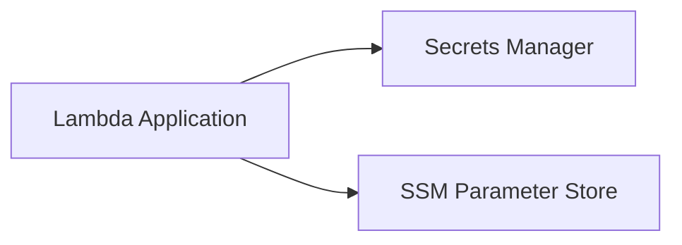

# Secrets Config Externalization

Secrets and Config Externalization keeps credentials and environment-specific settings out of application code. In AWS, this is commonly done with Secrets Manager for sensitive values and Systems Manager Parameter Store for non-secret configuration.

## Problem it solves

Use this pattern to avoid hardcoding secrets, API keys, database passwords, and deploy-time config in source code. It improves security posture and simplifies rotating values without changing application binaries.

It is not ideal for values that must be fully static and never differ by environment.

## When to use

- Applications need different config across dev, staging, and production.
- Sensitive credentials must be centrally managed and rotated.
- Multiple services need consistent access to shared configuration values.

## Basic flow

1. App starts with references (names/ARNs) to config and secret locations.
2. App loads non-secret settings from Parameter Store.
3. App loads secret values from Secrets Manager.
4. App uses values in memory and avoids persisting plaintext credentials.

## What happens in AWS

- Secrets Manager stores encrypted secrets and supports rotation workflows.
- Parameter Store stores runtime configuration with optional encryption.
- IAM policies control exactly which app can read which values.
- CloudWatch captures access and app errors for troubleshooting.

## Message shape

A minimal secret payload might look like:

```json
{
  "username": "app_user",
  "password": "<redacted>"
}
```

Parameter Store values are typically plain strings such as `https://api.internal` or `featureXEnabled=true`.

## Mermaid diagram



## Example code

The `example/` folder uses Python to keep secret/config retrieval logic compact and easy to test.

The `cdk/` folder uses AWS CDK in TypeScript to provision one secret, one parameter, and a Lambda function with read permissions.

### Example snippets

```python
def get_config(parameter_name: str) -> str:
	resp = ssm_client.get_parameter(Name=parameter_name)
	return resp["Parameter"]["Value"]
```

```python
def get_secret(secret_id: str) -> dict:
	resp = secrets_client.get_secret_value(SecretId=secret_id)
	return json.loads(resp["SecretString"])
```

### CDK snippet

```ts
const dbSecret = new secretsmanager.Secret(this, 'DbCredentialsSecret');
const apiBaseUrl = new ssm.StringParameter(this, 'ApiBaseUrlParameter', {
	parameterName: '/sample/api/base-url',
	stringValue: 'https://api.internal.example',
});

dbSecret.grantRead(appFn);
apiBaseUrl.grantRead(appFn);
```

## Why it fits AWS well

- Managed secret storage and encryption by default.
- Fine-grained IAM access control for runtime retrieval.
- Native integrations with Lambda, ECS, and EC2 workloads.

## Failure handling

- Handle missing or malformed secret/config values explicitly.
- Cache values in memory per execution environment to reduce repeated calls.
- Fail fast on startup if critical secrets are unavailable.
- Rotate credentials safely and validate compatibility before cutover.

## Security and observability

- Grant least privilege IAM (`GetSecretValue`, `GetParameter`) to specific resources.
- Avoid logging plaintext secrets.
- Use CloudTrail/CloudWatch for access auditing and failure diagnosis.
- Apply KMS policies and secret rotation where required.

## Tradeoffs

- Adds runtime dependencies on AWS control plane APIs.
- Misconfigured IAM can cause startup/runtime failures.
- Frequent retrieval without caching can add latency and cost.

## Try it locally

1. Run the Python tests in `example/`.
2. Run `npm test -- --runInBand` in `cdk/`.
3. Use `cdk synth` to inspect the generated infrastructure before deployment.
