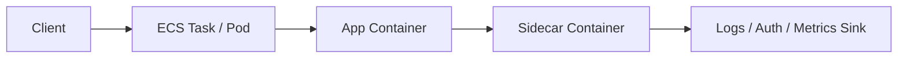

# Sidecar

Sidecar deploys a helper component next to the main application runtime so cross-cutting concerns can be added without changing the application code directly. The sidecar shares the same task or pod boundary as the app and handles concerns such as logging, auth proxying, metrics, or service mesh behavior.

## Problem it solves

Use this pattern when multiple services need the same operational behavior, but you do not want to embed that logic inside every application process. A sidecar can standardize observability, proxying, or security functions while keeping the app code focused on business behavior.

It is not ideal for tiny services where an extra container adds more complexity than value.

## When to use

- You need shared logging, metrics, auth, or proxy behavior beside the app.
- Multiple services should reuse the same cross-cutting runtime capability.
- You want to evolve operational helpers independently from app code.
- You are running on ECS or EKS where colocated containers are natural.

## Basic flow

1. The main application container handles business requests.
2. A sidecar container runs in the same task or pod.
3. The sidecar intercepts, enriches, proxies, or exports auxiliary data.
4. The application remains focused on its core request logic.

## What happens in AWS

- ECS or EKS runs the app and sidecar together in one task or pod.
- The app container serves business traffic.
- The sidecar container handles logging, auth proxying, or telemetry shipping.
- Shared networking and lifecycle make coordination between containers straightforward.

## Message shape

This pattern is runtime-topology focused. The example uses a simple app response and sidecar-enriched log record:

```json
{
	"path": "/health",
	"status": 200,
	"body": "served /health"
}
```

Sidecar output:

```json
{
	"service": "log-sidecar",
	"path": "/health",
	"status": 200,
	"message": "forwarded log for /health"
}
```

## Mermaid diagram



## Example code

The `example/` folder uses Python to show an application request, a sidecar auth check, and a sidecar log-enrichment step.

The `cdk/` folder uses AWS CDK in TypeScript to provision an ECS Fargate task definition with an app container and sidecar container.

### Example snippets

```python
def auth_proxy(headers: dict) -> dict:
		token = headers.get("authorization")
		return {
				"authorized": bool(token),
				"reason": "token present" if token else "missing token",
		}
```

```python
def invoke_with_sidecar(path: str, headers: dict) -> dict:
		auth = auth_proxy(headers)
		if not auth["authorized"]:
				return {"status": 401, "reason": auth["reason"]}

		response = handle_request(path)
		log_record = enrich_log(response)
		return {"response": response, "sidecarLog": log_record}
```

### CDK snippet

```ts
taskDefinition.addContainer('AppContainer', {
	image: ecs.ContainerImage.fromRegistry('public.ecr.aws/docker/library/nginx:latest'),
	portMappings: [{ containerPort: 80 }],
});

taskDefinition.addContainer('LogSidecar', {
	image: ecs.ContainerImage.fromRegistry('public.ecr.aws/docker/library/busybox:latest'),
	essential: false,
});
```

## Why it fits AWS well

- ECS and EKS support multiple colocated containers naturally.
- Sidecars are a clean fit for logging agents, auth proxies, and service-mesh helpers.
- Teams can standardize infrastructure behavior without modifying each app deeply.

## Failure handling

- Decide whether the sidecar is essential or optional for task health.
- Watch for resource contention between the app and sidecar in the same task.
- Keep sidecar restarts and telemetry failures visible in metrics.
- Use health checks where the sidecar materially affects request flow.

## Security and observability

- Give the sidecar only the permissions it needs for its cross-cutting responsibility.
- Separate app logs from sidecar logs for easier diagnosis.
- Track CPU and memory for both containers because they share task resources.
- Avoid letting a proxy sidecar silently alter business behavior without visibility.

## Tradeoffs

- More containers per task means more operational overhead.
- Resource tuning becomes more important because app and sidecar share limits.
- Debugging can be more complex when behavior is split across containers.

## Try it locally

1. Run the Python tests in `example/`.
2. Run `npm install` and `npm test -- --runInBand` in `cdk/`.
3. Use `npm run cdk -- synth` to inspect the generated infrastructure.
