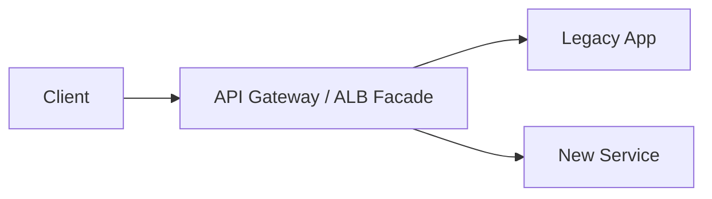

# Strangler Facade at the Edge

Strangler at the edge incrementally routes traffic from a legacy backend to new services behind a facade, allowing migration without big-bang rewrite.

## Problem it solves

Legacy systems are risky to replace in one cutover. Strangler enables gradual migration path by endpoint or traffic slice.

## When to use

- You are modernizing a monolith gradually.
- You need zero-downtime migration.

## Basic flow

1. Requests enter a facade router.
2. Some paths go to legacy service.
3. Migrated paths go to new microservice.
4. Routing rules evolve until legacy is removed.

## Mermaid diagram

## Example code

Python example routes requests by path prefix to legacy or modern handler.

## Why it fits AWS well

- API Gateway and ALB support path-based routing.
- Route rules can evolve safely over time.

## Failure handling

- Keep rollback routing to legacy for newly migrated paths.

## Security and observability

- Monitor routed traffic split and error rate by target.

## Tradeoffs

- Dual-run period adds operational complexity.

## Try it locally

1. Run `pytest -q` in `example/`.
2. Run `npm install && npm test -- --runInBand` in `cdk/`.
