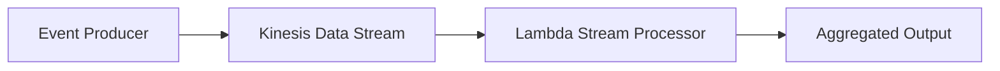

# Streaming Ingestion

Streaming Ingestion continuously accepts event data as it is produced and processes it in near real time. Instead of waiting for scheduled batches or individual request/response cycles, events flow through a stream where consumers read ordered records in batches or shards.

## Problem it solves

Use this pattern when events arrive continuously and you need low-latency processing, aggregation, or enrichment at scale. It is common for clickstreams, IoT telemetry, logs, and operational metrics.

It is not ideal when data can be processed on a simple recurring batch schedule.

## When to use

- Events arrive continuously through the day.
- You need near-real-time insights or downstream processing.
- Ordering within a shard or partition matters.
- You want buffering between producers and consumers at stream scale.

## Basic flow

1. Producers emit events to a stream.
2. The stream buffers and orders records by shard.
3. A consumer reads batches from the stream.
4. The consumer normalizes, aggregates, or forwards the records.

## What happens in AWS

- Kinesis Data Streams accepts a continuous flow of records.
- Lambda can consume Kinesis batches with managed checkpointing.
- Shards provide scaling and ordering boundaries.
- CloudWatch captures ingest rates, iterator age, and consumer errors.

## Message shape

Sample click event:

```json
{
	"userId": "u-4",
	"page": "/Docs",
	"eventType": "page-view"
}
```

Aggregated batch result:

```json
{
	"recordCount": 3,
	"pageCounts": {
		"/home": 2,
		"/pricing": 1
	}
}
```

## Mermaid diagram



## Example code

The `example/` folder uses Python to show Kinesis-style batch decoding, normalization, and page-count aggregation.

The `cdk/` folder uses AWS CDK in TypeScript to provision the Kinesis stream and Lambda event source mapping.

### Example snippets

```python
def normalize_event(event: dict) -> dict:
		return {
				"userId": event["userId"],
				"page": event["page"].lower(),
				"eventType": event["eventType"],
		}
```

```python
def handler(event, context):
		records = []
		for record in event.get("Records", []):
				payload = base64.b64decode(record["kinesis"]["data"]).decode("utf-8")
				records.append(json.loads(payload))
		return process_batch(records)
```

### CDK snippet

```ts
const stream = new kinesis.Stream(this, 'Clickstream', {
	shardCount: 1,
	streamName: 'clickstream-events',
});

processor.addEventSource(
	new lambdaEventSources.KinesisEventSource(stream, {
		batchSize: 100,
		startingPosition: lambda.StartingPosition.TRIM_HORIZON,
	}),
);
```

## Why it fits AWS well

- Kinesis is designed for durable streaming ingestion.
- Lambda lets you process streams without managing consumer hosts.
- The platform naturally supports replay, batching, and scaling by shard.

## Failure handling

- Keep processors idempotent because batches can be retried.
- Monitor iterator age to catch lagging consumers.
- Bound batch size and timeout to avoid poison-record stalls.
- Route irrecoverable records to secondary workflows when needed.

## Security and observability

- Producers need permission to put records on the stream.
- Consumers need permission to read stream shards and emit logs.
- Track shard throughput, Lambda errors, duration, and iterator age.
- Log request correlation fields like `userId` when troubleshooting.

## Tradeoffs

- Stream consumers introduce operational concepts like shard scaling and replay.
- Ordering guarantees are partitioned, not global.
- Near-real-time systems can become more complex than scheduled batch flows.

## Try it locally

1. Run the Python tests in `example/`.
2. Run `npm install` and `npm test -- --runInBand` in `cdk/`.
3. Use `npm run cdk -- synth` to inspect the generated infrastructure.
