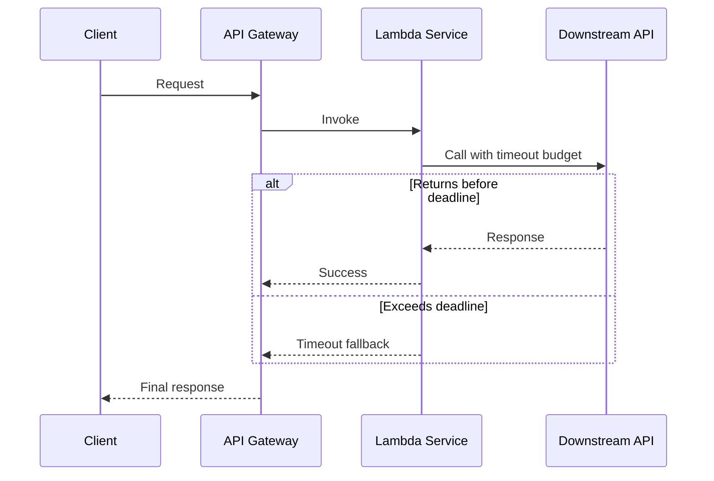

# Timeout

Timeout sets an upper bound on how long a request can wait for a dependency before failing or falling back. It prevents stuck calls from consuming worker capacity and keeps service latency predictable.

## Problem it solves

Without explicit time limits, slow dependencies can tie up threads, containers, or Lambda concurrency until requests pile up and an outage spreads upstream. A timeout forces fast decisions under slowness.

Use this pattern when calling external APIs, databases, or internal services with variable latency.

## When to use

- You depend on services that occasionally exceed expected latency.
- You need strict user-facing response-time goals.
- You want predictable degradation instead of indefinite waiting.
- You combine this with retries, circuit breakers, or fallbacks.

## Basic flow

1. Caller starts a dependency request and a timeout budget.
2. If dependency returns before deadline, result is accepted.
3. If deadline is exceeded, caller aborts wait and returns fallback or error.
4. Metrics and logs capture timeout events for tuning.

## What happens in AWS

- Lambda timeout is configured at function level.
- SDK clients can have per-call timeouts.
- API Gateway and ALB idle/read timeouts define upstream limits.
- Step Functions can enforce state-level timeout and heartbeat policies.

## Message shape

Example request:

```json
{
	"requestId": "req-501",
	"operation": "fetchProfile",
	"timeoutMs": 250
}
```

Success response:

```json
{
	"status": "ok",
	"elapsedMs": 120,
	"result": {
		"profileId": "user-42"
	}
}
```

Timeout fallback response:

```json
{
	"status": "timeout",
	"elapsedMs": 251,
	"fallback": "cached-profile"
}
```

## Mermaid diagram



## Example code

The `example/` folder simulates timeout-aware request handling in Python, including fallback behavior and tests for in-budget and over-budget cases.

The `cdk/` folder provisions a reference stack in AWS CDK with Lambda, API Gateway, and timeout-related configuration.

### Example snippets

```python
if observed_latency_ms > timeout_ms:
		return {
				"status": "timeout",
				"elapsedMs": observed_latency_ms,
				"fallback": fallback_value,
		}
```

```python
return {
		"status": "ok",
		"elapsedMs": observed_latency_ms,
		"result": dependency_result,
}
```

### CDK snippet

```ts
const handler = new lambda.Function(this, 'TimeoutHandler', {
	runtime: lambda.Runtime.PYTHON_3_12,
	handler: 'index.handler',
	timeout: cdk.Duration.seconds(3),
	code: lambda.Code.fromInline('def handler(event, context): return {"statusCode": 200, "body": "ok"}'),
});
```

## Why it fits AWS well

- Lambda and Step Functions have native timeout controls.
- API Gateway enforces edge timeouts to protect clients.
- CloudWatch metrics make timeout-rate tracking straightforward.
- Timeout tuning can be rolled out safely with aliases and staged deployment.

## Failure handling

- Return explicit timeout responses so callers can distinguish from business errors.
- Pair timeouts with bounded retries and jitter to avoid synchronized retry storms.
- Ensure downstream calls are idempotent if retrying after timeout.
- Avoid setting all timeouts to the same value across tiers.

## Security and observability

- Avoid logging sensitive payloads in timeout error paths.
- Emit structured fields: dependency name, timeout budget, elapsed time, fallback used.
- Alert on sustained timeout-rate increase.
- Correlate timeout events with dependency latency and error metrics.

## Tradeoffs

- Too-short timeouts can cause avoidable failures.
- Too-long timeouts reduce the benefit and can still cause queueing.
- Timeout plus retry can increase total call volume if not constrained.
- Requires continuous tuning as traffic and downstream behavior changes.

## Try it locally

1. Run `pytest -q` in `example/`.
2. Run `npm install` and `npm test -- --runInBand` in `cdk/`.
3. Run `npm run cdk -- synth` to inspect generated infrastructure.
