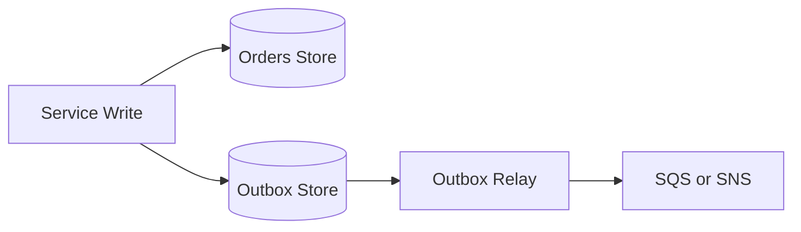

# Transactional Outbox

Transactional Outbox ensures that business data changes and event publication stay consistent without requiring a distributed transaction across the database and message broker. The application writes the business record and an outbox event in the same local transaction, then a relay process publishes the outbox event separately.

## Problem it solves

Use this pattern when a service must both update its database and publish an event, and losing either side would create inconsistency. Without an outbox, a crash between the database write and the message publish can leave downstream systems unaware of the change.

It is not ideal when the service never publishes state changes externally.

## When to use

- A database write must trigger a downstream event reliably.
- You cannot use one transaction across storage and messaging.
- Downstream consumers need accurate change events.
- Event publication can be eventually consistent but must not be lost.

## Basic flow

1. The service writes the business record.
2. In the same local transaction, it writes an outbox row or item.
3. A relay process reads pending outbox messages.
4. The relay publishes them to a queue or topic and marks them complete.

## What happens in AWS

- DynamoDB or RDS stores both the business record and outbox entry.
- Lambda or a scheduled/stream-driven relay publishes outbox messages.
- SQS or SNS receives the published integration event.
- Retries focus on the relay step without redoing the business write.

## Message shape

Business record:

```json
{
	"orderId": "order-401",
	"status": "PAID"
}
```

Outbox message:

```json
{
	"eventType": "OrderUpdated",
	"orderId": "order-401",
	"status": "PAID"
}
```

## Mermaid diagram



## Example code

The `example/` folder uses Python to show writing the order record and outbox message together, then draining the outbox with a relay function.

The `cdk/` folder uses AWS CDK in TypeScript to provision separate business and outbox storage plus a relay queue.

### Example snippets

```python
def write_order_and_outbox(order: dict) -> dict:
		ORDERS[order["orderId"]] = order
		message = {
				"eventType": "OrderUpdated",
				"orderId": order["orderId"],
				"status": order["status"],
		}
		OUTBOX.append(message)
		return {
				"order": ORDERS[order["orderId"]],
				"outboxMessage": message,
		}
```

```python
def publish_outbox() -> list[dict]:
		published = list(OUTBOX)
		OUTBOX.clear()
		return published
```

### CDK snippet

```ts
const ordersTable = new dynamodb.Table(this, 'OrdersTable', {
	partitionKey: { name: 'orderId', type: dynamodb.AttributeType.STRING },
	billingMode: dynamodb.BillingMode.PAY_PER_REQUEST,
});

const outboxTable = new dynamodb.Table(this, 'OutboxTable', {
	partitionKey: { name: 'orderId', type: dynamodb.AttributeType.STRING },
	sortKey: { name: 'eventType', type: dynamodb.AttributeType.STRING },
	billingMode: dynamodb.BillingMode.PAY_PER_REQUEST,
});
```

## Why it fits AWS well

- DynamoDB and RDS can act as durable local-transaction stores for outbox records.
- Lambda makes an efficient relay/publisher for draining pending outbox items.
- SQS or SNS cleanly decouples downstream delivery from the primary write path.

## Failure handling

- Make relay publishing idempotent because retries can repeat sends.
- Keep outbox entries until publication is confirmed.
- Monitor relay lag so pending events do not accumulate silently.
- Support replay or redrive if a downstream queue/topic is temporarily unavailable.

## Security and observability

- Limit write access to business and outbox stores to the owning service.
- Grant relay functions only the permissions needed to read outbox data and publish messages.
- Track outbox depth, publish failures, and relay duration.
- Include entity IDs like `orderId` in both business logs and outbox logs.

## Tradeoffs

- You maintain extra storage and relay logic.
- Published events are usually eventually consistent, not immediate.
- Cleanup of published outbox records requires an explicit retention policy.

## Try it locally

1. Run the Python tests in `example/`.
2. Run `npm install` and `npm test -- --runInBand` in `cdk/`.
3. Use `npm run cdk -- synth` to inspect the generated infrastructure.
