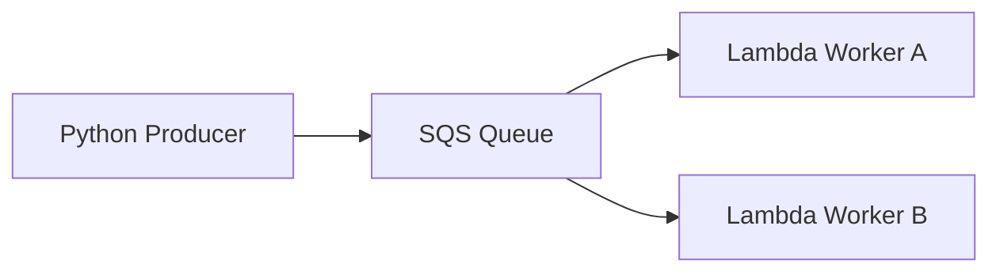

# Work Queue / Competing Consumers

Work Queue / Competing Consumers uses one SQS queue and multiple workers that pull from it independently. Each message is processed by only one worker, so throughput increases as you add more consumers.

## Problem it solves

Use this pattern when a background workload is growing faster than a single worker can handle. The queue spreads work across multiple consumers and keeps the system responsive under load.

It is not a fit for broadcast-style processing where every consumer must see the same message.

## When to use

- You want to scale background processing horizontally.
- Any worker can process any message.
- You need to smooth throughput without duplicating work to all consumers.

## Basic flow

1. A producer sends jobs to an SQS queue.
2. Two or more workers poll the same queue.
3. SQS hands each message to one worker at a time.
4. The workers process jobs independently and can scale on their own.

## What happens in AWS

- SQS distributes messages across competing consumers so one job is not processed by multiple workers at once.
- Lambda or ECS workers can scale out as queue depth grows.
- Visibility timeout keeps a message hidden while a worker processes it.
- If one worker is slow, the others keep draining the queue.

## Message shape

The sample uses a simple job payload:

```json
{
  "jobId": "job-123",
  "priority": "normal"
}
```

That keeps the example focused on work distribution rather than on domain modeling.

## Mermaid diagram



## Example code

The `example/` folder uses Python because the message producer and worker logic are both small and easy to understand in a compact sample.

The `cdk/` folder uses AWS CDK in TypeScript to provision the queue and two competing Lambda workers.

### Example snippets

```python
def enqueue_job(sqs_client, queue_url: str, job_id: str) -> None:
	payload = f'{{"jobId": "{job_id}", "priority": "normal"}}'
	sqs_client.send_message(QueueUrl=queue_url, MessageBody=payload)
```

```python
def handler(event, context):
	for record in event.get("Records", []):
		print(f"worker processed: {record['body']}")
	return {"statusCode": 200, "body": "processed"}
```

### CDK snippet

```ts
const queue = new sqs.Queue(this, 'WorkQueue', {
	visibilityTimeout: Duration.seconds(60),
});

const workerA = new lambda.Function(this, 'WorkerA', {
	runtime: lambda.Runtime.PYTHON_3_12,
	code: lambda.Code.fromAsset('../example'),
	handler: 'worker.handler',
});

const workerB = new lambda.Function(this, 'WorkerB', {
	runtime: lambda.Runtime.PYTHON_3_12,
	code: lambda.Code.fromAsset('../example'),
	handler: 'worker.handler',
});

workerA.addEventSource(new SqsEventSource(queue));
workerB.addEventSource(new SqsEventSource(queue));
```

## Why it fits AWS well

- SQS is a natural work queue.
- Lambda workers can scale without managing servers.
- The pattern is easy to observe with queue depth and worker errors.

## Failure handling

- Add a DLQ if a job should stop retrying after repeated failures.
- Make the worker idempotent because retries can happen.
- Tune visibility timeout to match the job runtime.
- Watch for hot partitions in the queueing logic if one worker dominates.

## Security and observability

- The producer needs permission to send to the queue.
- Each worker needs permission to receive and delete messages.
- CloudWatch metrics should track queue depth, age of oldest message, and worker errors.
- Logs should include correlation ids or job ids so you can trace a job across retries.

## Tradeoffs

- One queue means one consumer bottleneck if the workers cannot keep up.
- Messages are not broadcast to every worker, so this does not fit fan-out use cases.
- The pattern favors throughput over strict worker affinity.

## Try it locally

1. Run the Python tests in `example/`.
2. Run `npm test -- --runInBand` in `cdk/`.
3. Use `cdk synth` to inspect the generated infrastructure before deployment.