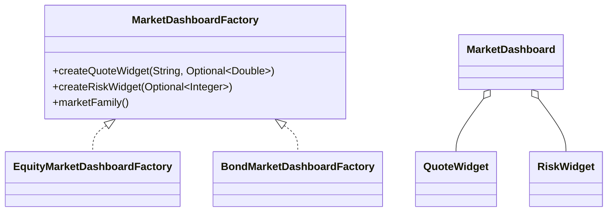

# Abstract Factory Pattern

This example models market dashboard creation for different asset classes. A single factory family creates a matching quote widget and risk widget so each dashboard stays internally consistent.

## Why this fits

Equities and bonds need related presentation components, but the concrete classes differ. Abstract factory keeps those families aligned without scattering `if` and `switch` logic throughout the codebase.

## Structure

## Java features used

- `switch` expressions to choose a factory family
- `record` types for immutable widgets and dashboard composition
- `sealed` interfaces to constrain the allowed product families
- `Optional` to model missing market data without `null`
