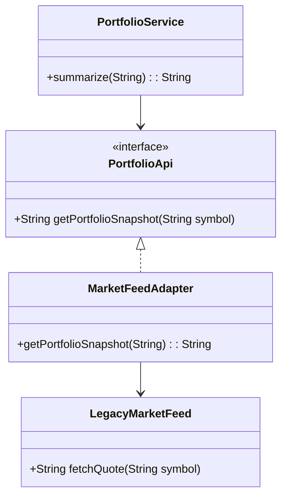

# Adapter Pattern

This example shows how a legacy trading API can be adapted to a modern portfolio service interface without changing the original implementation.

## Why this fits

The Adapter pattern is useful when two systems expose different interfaces but need to cooperate. In finance, old market-data systems often need to talk to newer trading platforms.

## Java 25 features used

- Records for immutable transfer objects
- Optional-based handling in the service layer
- Switch expressions for status mapping

## Mermaid diagram

## Flow

1. A legacy feed exposes a dated method signature.
2. An adapter wraps that legacy API behind the new interface.
3. The service consumes the adapted interface without knowing about the legacy implementation.
