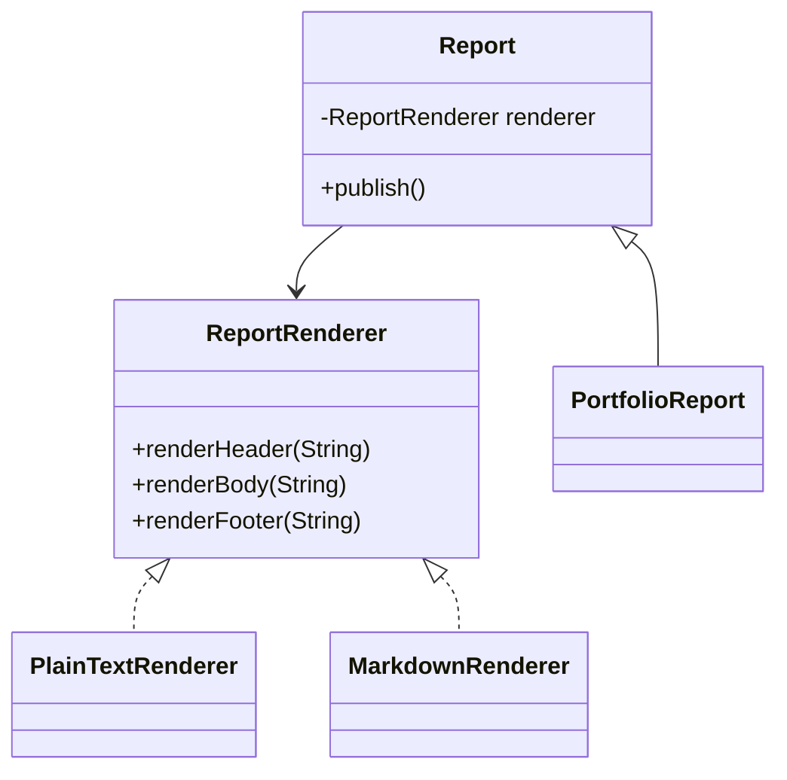

# Bridge Pattern

This example models a portfolio report abstraction that can be rendered through different output channels. The report structure stays separate from the rendering implementation, so both can evolve independently.

## Why it fits

A report has a stable concept, but the output format changes often. Bridge lets the portfolio report focus on business content while renderer implementations handle presentation details.

## Structure

## Java features used

- Abstract base class for the report abstraction
- Interface-based renderer implementations
- `System.lineSeparator()` for platform-aware formatting
- A small immutable object graph that keeps presentation and behavior separate

## Problem it solves

This pattern addresses a recurring design issue by separating responsibilities and reducing tight coupling in Bridge Pattern scenarios.

## When to use

- Use this pattern when you need cleaner separation of concerns in Bridge Pattern code.
- Use it when you expect variation in behavior and want to avoid complex conditionals.
- Use it when maintainability and extension are more important than one-off shortcuts.

## Example from Java/JDK

The JDK often separates abstraction from implementation so both can vary independently.

- JDK classes: java.sql.DriverManager (abstraction), java.sql.Driver (implementations)
- Reference: https://docs.oracle.com/en/java/javase/25/docs/api/java.sql/java/sql/DriverManager.html
