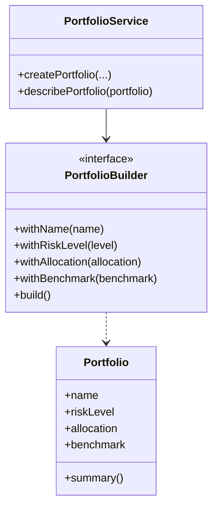

# Builder Pattern

This example demonstrates the Builder pattern for creating finance portfolios. It intentionally uses modern Java 25-friendly constructs such as records, switch expressions, and Optional-based flow.

## Structure

## Why it fits

- The builder hides complex object construction behind a fluent API.
- Optional and switch expressions make the validation and summary logic more expressive.
- The resulting code stays readable while still being modern and type-safe.

## Java 25 features used

- Records for immutable portfolio data
- Switch expressions for summary classification
- Optional for null-safe description flow

## Problem it solves

This pattern addresses a recurring design issue by separating responsibilities and reducing tight coupling in Builder Pattern scenarios.

## When to use

- Use this pattern when you need cleaner separation of concerns in Builder Pattern code.
- Use it when you expect variation in behavior and want to avoid complex conditionals.
- Use it when maintainability and extension are more important than one-off shortcuts.

## Example from Java/JDK

Builder appears in fluent object construction APIs for immutable or complex objects.

- JDK classes: java.lang.StringBuilder, java.net.http.HttpRequest.Builder
- Reference: https://docs.oracle.com/en/java/javase/25/docs/api/java.net.http/java/net/http/HttpRequest.Builder.html
