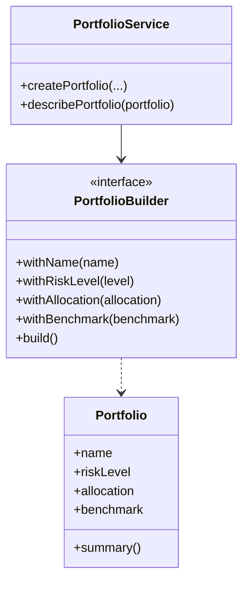

# Builder Pattern

This example demonstrates the Builder pattern for creating finance portfolios. It intentionally uses modern Java 25-friendly constructs such as records, switch expressions, and Optional-based flow.

## Structure

## Why it fits

- The builder hides complex object construction behind a fluent API.
- Optional and switch expressions make the validation and summary logic more expressive.
- The resulting code stays readable while still being modern and type-safe.

## Java 25 features used

- Records for immutable portfolio data
- Switch expressions for summary classification
- Optional for null-safe description flow
