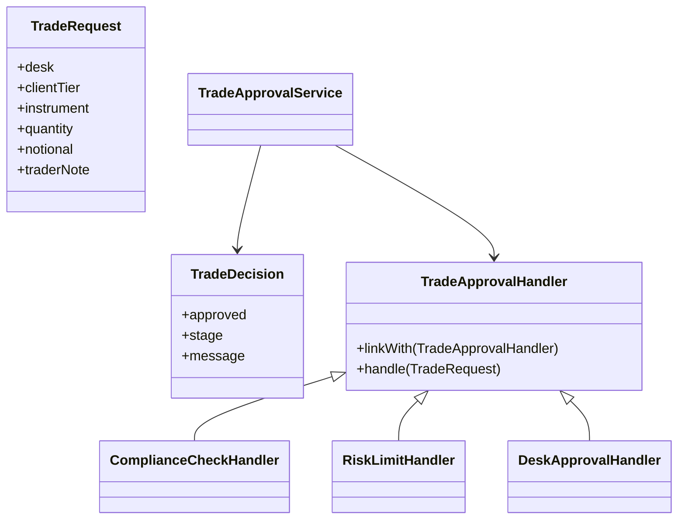

# Chain of Responsibility

This example models a trade approval workflow where compliance, risk, and desk approval checks are linked together. The first handler that can answer stops the chain and returns the decision.

## Why it fits

Trade review is naturally sequential. Some checks reject immediately, while others pass the request onward until an approver signs off.

## Structure

## Java features used

- Records for immutable request and decision data
- Switch expressions for tier-based risk limits
- `Optional` for trader notes
- Streams and lambdas in the compliance handler and demo app

## Problem it solves

This pattern addresses a recurring design issue by separating responsibilities and reducing tight coupling in Chain of Responsibility scenarios.

## When to use

- Use this pattern when you need cleaner separation of concerns in Chain of Responsibility code.
- Use it when you expect variation in behavior and want to avoid complex conditionals.
- Use it when maintainability and extension are more important than one-off shortcuts.

## Example from Java/JDK

The JDK applies chained handling where requests are passed through linked processors.

- JDK classes: java.util.logging.Logger, java.util.logging.Handler
- Reference: https://docs.oracle.com/en/java/javase/25/docs/api/java.logging/java/util/logging/Logger.html
