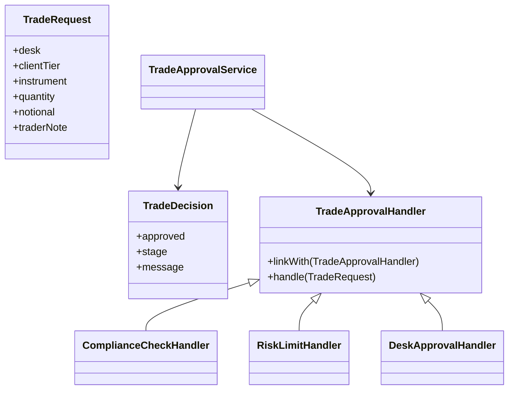

# Chain of Responsibility

This example models a trade approval workflow where compliance, risk, and desk approval checks are linked together. The first handler that can answer stops the chain and returns the decision.

## Why it fits

Trade review is naturally sequential. Some checks reject immediately, while others pass the request onward until an approver signs off.

## Structure

## Java features used

- Records for immutable request and decision data
- Switch expressions for tier-based risk limits
- `Optional` for trader notes
- Streams and lambdas in the compliance handler and demo app
