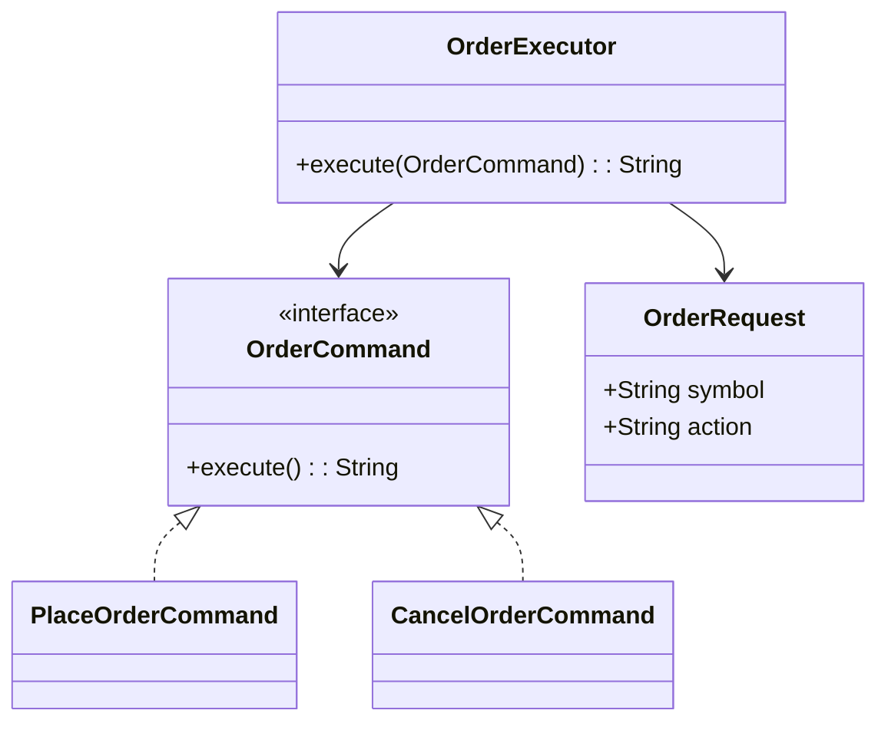

# Command Pattern

This example uses commands to represent financial actions such as placing and cancelling orders, allowing them to be queued or executed later.

## Why this fits

The Command pattern is useful when actions need to be wrapped into objects so they can be stored, logged, or undone. In trading systems, orders and risk checks are natural command candidates.

## Java 25 features used

- Records for immutable order payloads
- Optional-based handling in the invoker
- Switch expressions for command routing

## Mermaid diagram

## Flow

1. A command object captures a trading action.
2. The executor invokes the command without knowing its concrete implementation.
3. The result is returned as a simple string for the caller.

## Problem it solves

This pattern addresses a recurring design issue by separating responsibilities and reducing tight coupling in Command Pattern scenarios.

## When to use

- Use this pattern when you need cleaner separation of concerns in Command Pattern code.
- Use it when you expect variation in behavior and want to avoid complex conditionals.
- Use it when maintainability and extension are more important than one-off shortcuts.

## Example from Java/JDK

Command-like objects encapsulate executable behavior for deferred or managed execution.

- JDK classes: java.lang.Runnable, java.util.concurrent.Callable
- Reference: https://docs.oracle.com/en/java/javase/25/docs/api/java.base/java/lang/Runnable.html
