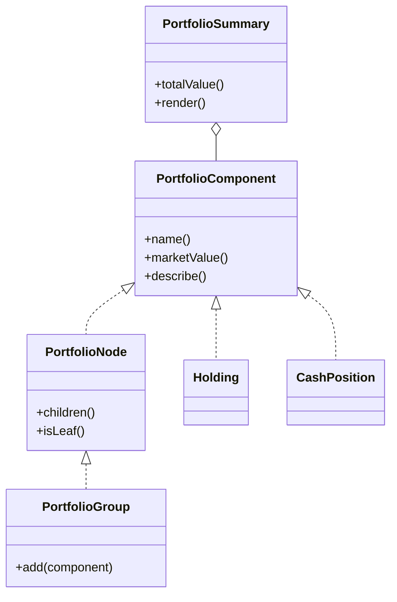

# Composite Pattern

This example models a portfolio tree where both individual holdings and nested portfolio groups are treated as portfolio components. The same operations work on both leaves and composites.

## Why it fits

Financial portfolios naturally form trees: a portfolio can contain positions, cash, and other sub-portfolios. Composite lets the client treat the whole structure uniformly while the group object handles aggregation.

## Structure

## Java features used

- Records for immutable leaf components and summary data
- `Optional` for missing sector metadata and strategy notes
- Stream aggregation for tree value calculation
- A small immutable API surface to keep the tree easy to reason about

## Problem it solves

This pattern addresses a recurring design issue by separating responsibilities and reducing tight coupling in Composite Pattern scenarios.

## When to use

- Use this pattern when you need cleaner separation of concerns in Composite Pattern code.
- Use it when you expect variation in behavior and want to avoid complex conditionals.
- Use it when maintainability and extension are more important than one-off shortcuts.

## Example from Java/JDK

The JDK uses composite-style structures to treat single elements and groups uniformly.

- JDK classes: java.awt.Container, java.awt.Component
- Reference: https://docs.oracle.com/en/java/javase/25/docs/api/java.desktop/java/awt/Container.html
