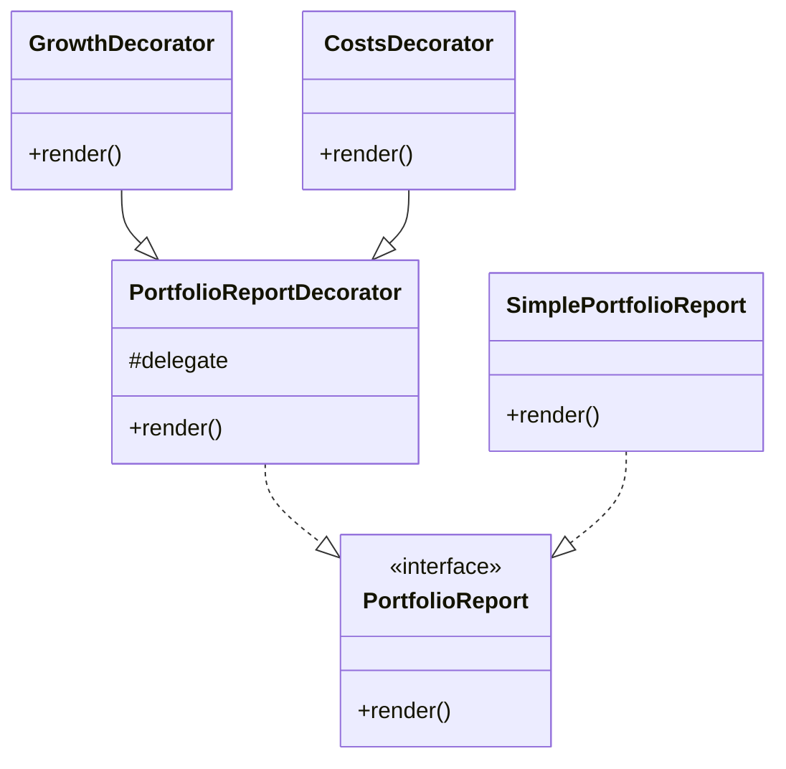

# Decorator Pattern

This example shows how the Decorator pattern can add responsibilities to a financial report without modifying the original component.

## Structure

## Why it fits

- The base report can be wrapped with extra insights such as growth or costs.
- Each decorator composes behavior around the existing report.
- The original report interface stays intact.

## SOLID notes

- Open/closed principle: new report features can be added through new decorators.
- Single responsibility: each decorator handles one responsibility.
- Dependency inversion: the decorators depend on the interface rather than a concrete implementation.

## Problem it solves

This pattern addresses a recurring design issue by separating responsibilities and reducing tight coupling in Decorator Pattern scenarios.

## When to use

- Use this pattern when you need cleaner separation of concerns in Decorator Pattern code.
- Use it when you expect variation in behavior and want to avoid complex conditionals.
- Use it when maintainability and extension are more important than one-off shortcuts.

## Example from Java/JDK

Decorator is heavily used in I/O where wrappers add behavior around streams.

- JDK classes: java.io.BufferedInputStream, java.io.DataInputStream, java.io.FilterInputStream
- Reference: https://docs.oracle.com/en/java/javase/25/docs/api/java.base/java/io/FilterInputStream.html
