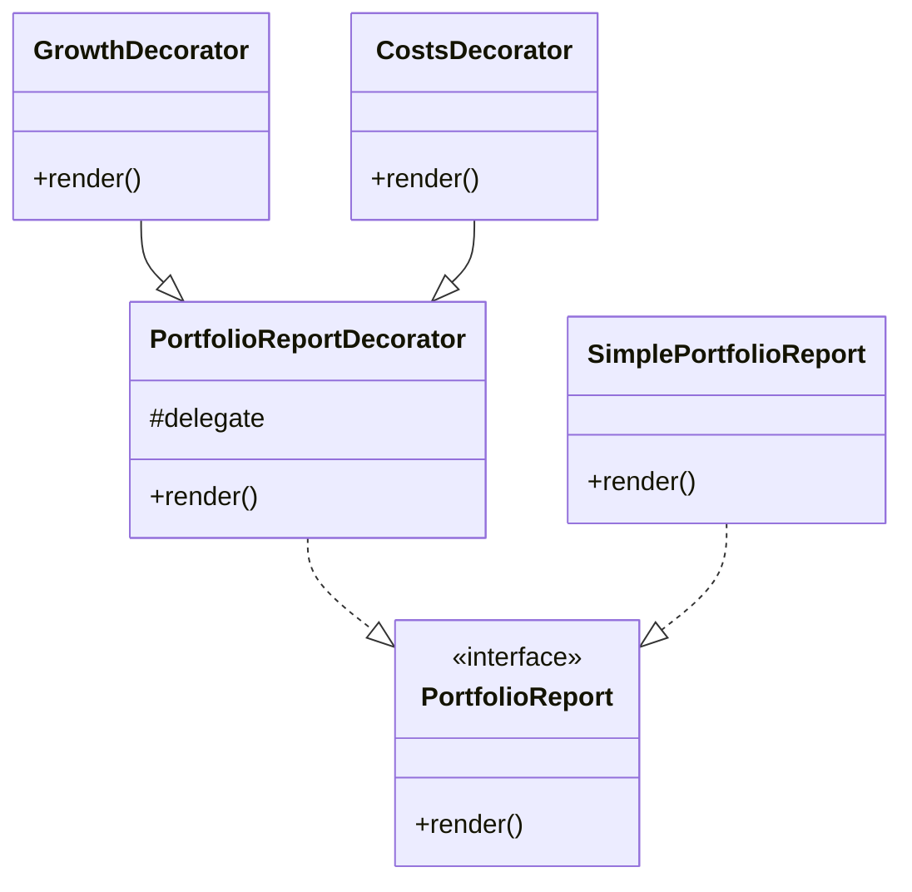

# Decorator Pattern

This example shows how the Decorator pattern can add responsibilities to a financial report without modifying the original component.

## Structure

## Why it fits

- The base report can be wrapped with extra insights such as growth or costs.
- Each decorator composes behavior around the existing report.
- The original report interface stays intact.

## SOLID notes

- Open/closed principle: new report features can be added through new decorators.
- Single responsibility: each decorator handles one responsibility.
- Dependency inversion: the decorators depend on the interface rather than a concrete implementation.
