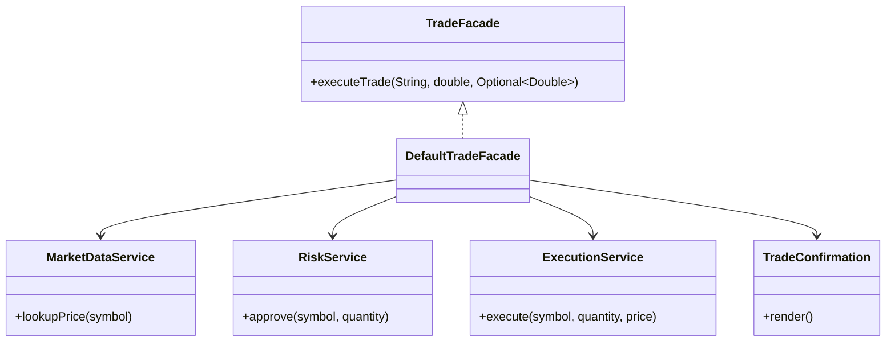

# Facade Pattern

This example models a trade execution facade that hides market data, risk, and execution subsystems behind one simple API.

## Why it fits

A trading client wants one entry point to execute an order, not a chain of direct calls into every subsystem. Facade reduces coupling and keeps the orchestration logic in one place.

## Structure

## Java features used

- `Optional` for missing price flow
- Records for immutable trade confirmations
- `switch` expressions in market data lookup
- Clear service boundaries to keep orchestration readable

## Problem it solves

This pattern addresses a recurring design issue by separating responsibilities and reducing tight coupling in Facade Pattern scenarios.

## When to use

- Use this pattern when you need cleaner separation of concerns in Facade Pattern code.
- Use it when you expect variation in behavior and want to avoid complex conditionals.
- Use it when maintainability and extension are more important than one-off shortcuts.
