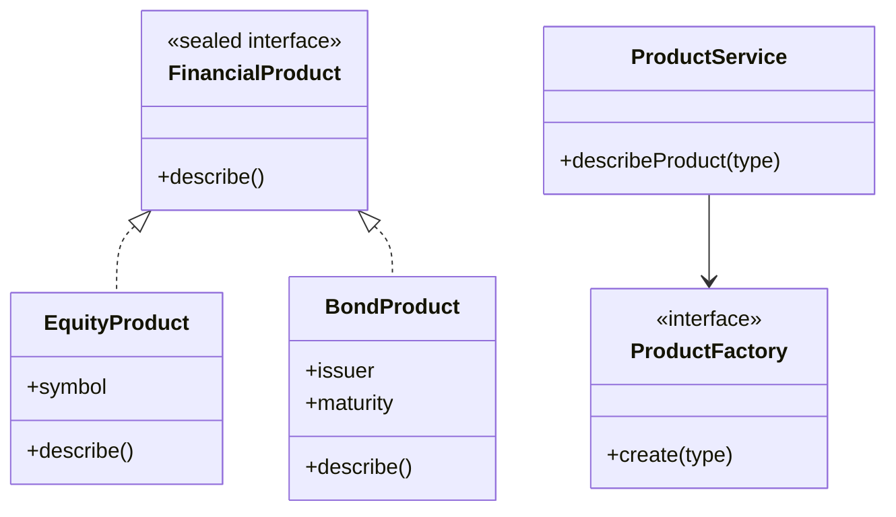

# Factory Method Pattern

This example demonstrates the Factory Method pattern with a finance-oriented product registry. It also highlights Java 25 features such as sealed interfaces, records, and switch expressions.

## Structure

## Why it fits

- The creation logic is isolated behind a factory.
- New product types can be added without changing the service that consumes them.
- The example uses modern Java language constructs to make the design more expressive.

## Java 25 features used

- Sealed interfaces for controlled subtype hierarchies
- Records for immutable product data objects
- Switch expressions with Optional-based factory resolution

## Problem it solves

This pattern addresses a recurring design issue by separating responsibilities and reducing tight coupling in Factory Method Pattern scenarios.

## When to use

- Use this pattern when you need cleaner separation of concerns in Factory Method Pattern code.
- Use it when you expect variation in behavior and want to avoid complex conditionals.
- Use it when maintainability and extension are more important than one-off shortcuts.

## Example from Java/JDK

Factory methods centralize object creation behind stable APIs.

- JDK classes: java.util.Calendar#getInstance, java.text.NumberFormat#getInstance
- Reference: https://docs.oracle.com/en/java/javase/25/docs/api/java.base/java/util/Calendar.html#getInstance()
