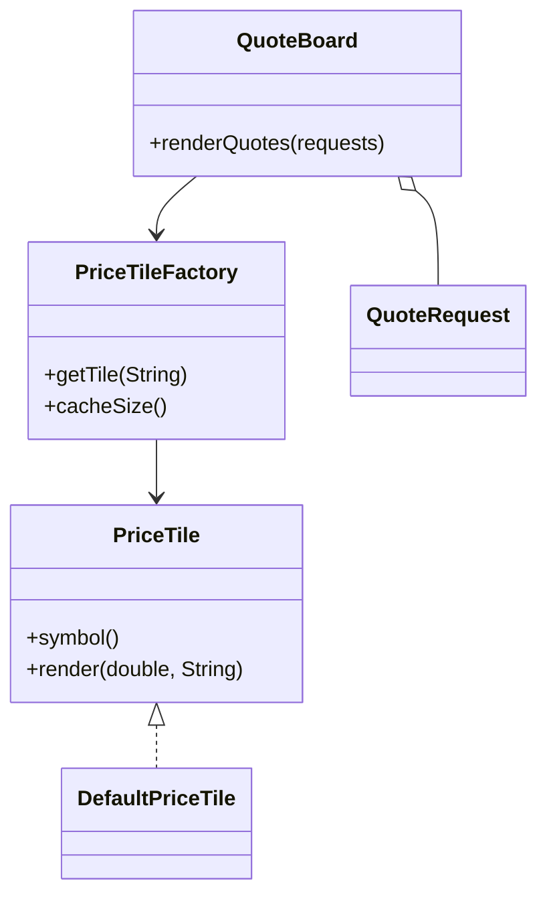

# Flyweight Pattern

This example models a quote board that reuses one shared price tile per symbol. The tile stores intrinsic state, while each quote request supplies extrinsic market data.

## Why it fits

A market screen can render the same symbol many times with different prices and venues. Flyweight avoids duplicating the symbol-specific object each time and keeps the cache small.

## Structure

## Java features used

- Records for immutable flyweight state and request data
- `Optional` for additional metadata on quote requests
- `ConcurrentHashMap` for safe shared caching
- Stream mapping to keep rendering logic concise

## Problem it solves

This pattern addresses a recurring design issue by separating responsibilities and reducing tight coupling in Flyweight Pattern scenarios.

## When to use

- Use this pattern when you need cleaner separation of concerns in Flyweight Pattern code.
- Use it when you expect variation in behavior and want to avoid complex conditionals.
- Use it when maintainability and extension are more important than one-off shortcuts.

## Example from Java/JDK

Flyweight is used for object reuse to reduce allocation and memory pressure.

- JDK classes: java.lang.Integer#valueOf, java.lang.Boolean#valueOf
- Reference: https://docs.oracle.com/en/java/javase/25/docs/api/java.base/java/lang/Integer.html#valueOf(int)
