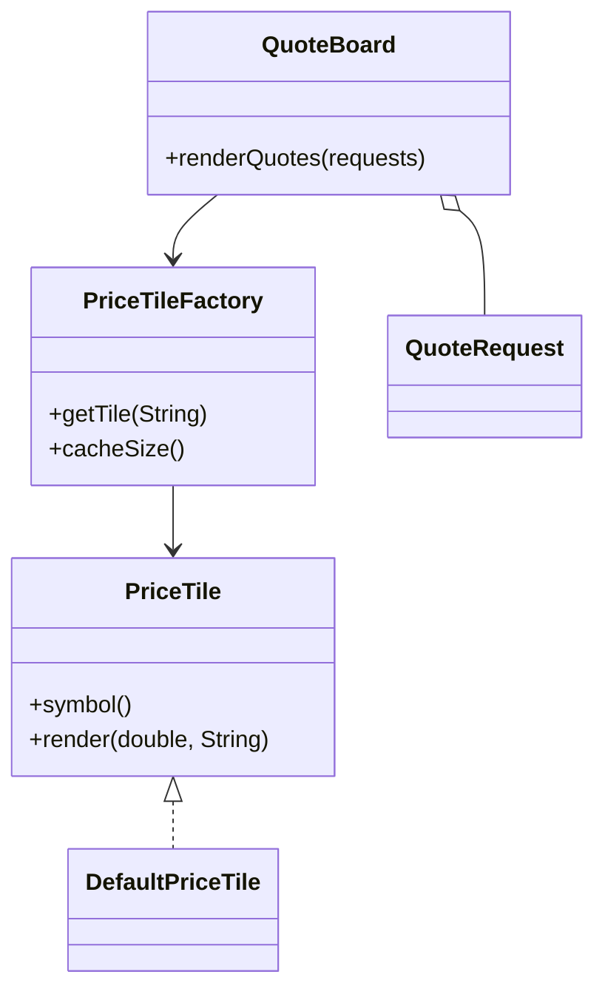

# Flyweight Pattern

This example models a quote board that reuses one shared price tile per symbol. The tile stores intrinsic state, while each quote request supplies extrinsic market data.

## Why it fits

A market screen can render the same symbol many times with different prices and venues. Flyweight avoids duplicating the symbol-specific object each time and keeps the cache small.

## Structure

## Java features used

- Records for immutable flyweight state and request data
- `Optional` for additional metadata on quote requests
- `ConcurrentHashMap` for safe shared caching
- Stream mapping to keep rendering logic concise
