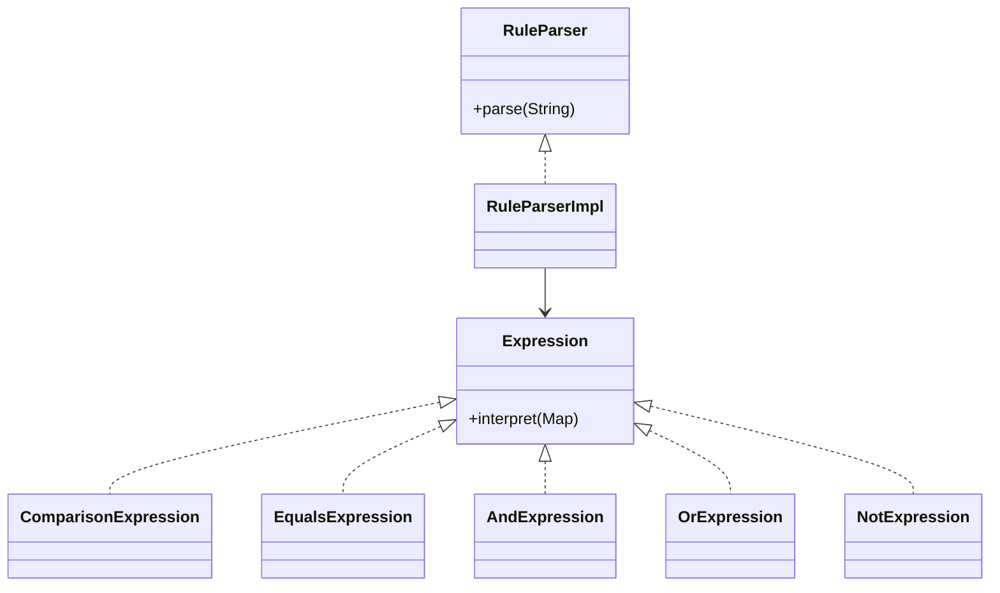

# Interpreter Pattern

This example models a small portfolio rule language. The parser turns text rules into an expression tree, and the interpreter evaluates that tree against a portfolio context.

## Why it fits

Rule evaluation is easier to extend when each grammar fragment becomes its own object. Interpreter keeps parsing and evaluation composable while still being easy to test.

## Structure

## Java features used

- Records for compact expression nodes
- `Map`-based context input
- `switch` expressions inside comparison evaluation
- `Optional` is intentionally avoided here because the grammar is explicit and string-driven
