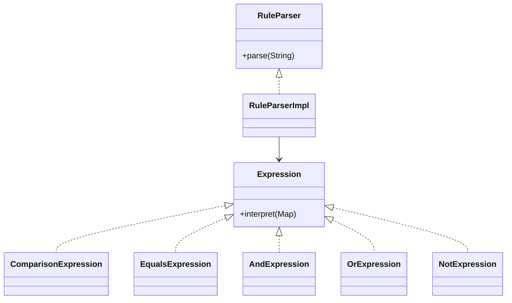

# Interpreter Pattern

This example models a small portfolio rule language. The parser turns text rules into an expression tree, and the interpreter evaluates that tree against a portfolio context.

## Why it fits

Rule evaluation is easier to extend when each grammar fragment becomes its own object. Interpreter keeps parsing and evaluation composable while still being easy to test.

## Structure

## Java features used

- Records for compact expression nodes
- `Map`-based context input
- `switch` expressions inside comparison evaluation
- `Optional` is intentionally avoided here because the grammar is explicit and string-driven

## Problem it solves

This pattern addresses a recurring design issue by separating responsibilities and reducing tight coupling in Interpreter Pattern scenarios.

## When to use

- Use this pattern when you need cleaner separation of concerns in Interpreter Pattern code.
- Use it when you expect variation in behavior and want to avoid complex conditionals.
- Use it when maintainability and extension are more important than one-off shortcuts.

## Example from Java/JDK

The JDK includes interpreters that parse and execute mini languages or patterns.

- JDK classes: java.util.regex.Pattern, java.text.MessageFormat
- Reference: https://docs.oracle.com/en/java/javase/25/docs/api/java.base/java/util/regex/Pattern.html
