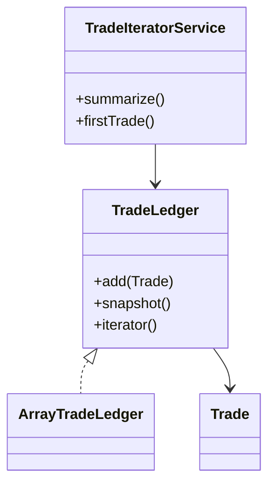

# Iterator Pattern

This example models a trade ledger that can be traversed without exposing its internal storage. The ledger provides a stable iteration surface while the implementation stays hidden.

## Why it fits

A blotter or trade ledger should be easy to walk in order, but callers should not care whether the data is stored in a list, tree, or some other structure. Iterator separates traversal from storage.

## Structure

## Java features used

- Records for compact trade data
- `Optional` for trade notes
- `Iterable` and `Iterator` for explicit traversal
- Stream support for turning iteration results into summaries
