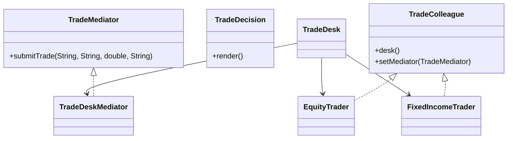

# Mediator Pattern

This example models a trade desk where traders send requests through a central mediator instead of calling each other directly. The mediator owns the coordination logic and keeps the colleagues loosely coupled.

## Why it fits

Trade desks often need routing and validation rules that should not be duplicated in each trader. Mediator centralizes that behavior and keeps each colleague focused on its own request.

## Structure

## Java features used

- Records for immutable trade decisions
- `Optional` for route derivation inside the mediator
- Interface-based colleagues to keep requesters decoupled
- Small coordination object that acts as the single integration point

## Problem it solves

This pattern addresses a recurring design issue by separating responsibilities and reducing tight coupling in Mediator Pattern scenarios.

## When to use

- Use this pattern when you need cleaner separation of concerns in Mediator Pattern code.
- Use it when you expect variation in behavior and want to avoid complex conditionals.
- Use it when maintainability and extension are more important than one-off shortcuts.

## Example from Java/JDK

Mediator-like coordination appears in UI and event infrastructure.

- JDK classes: java.beans.PropertyChangeSupport, java.awt.EventQueue
- Reference: https://docs.oracle.com/en/java/javase/25/docs/api/java.desktop/java/beans/PropertyChangeSupport.html
